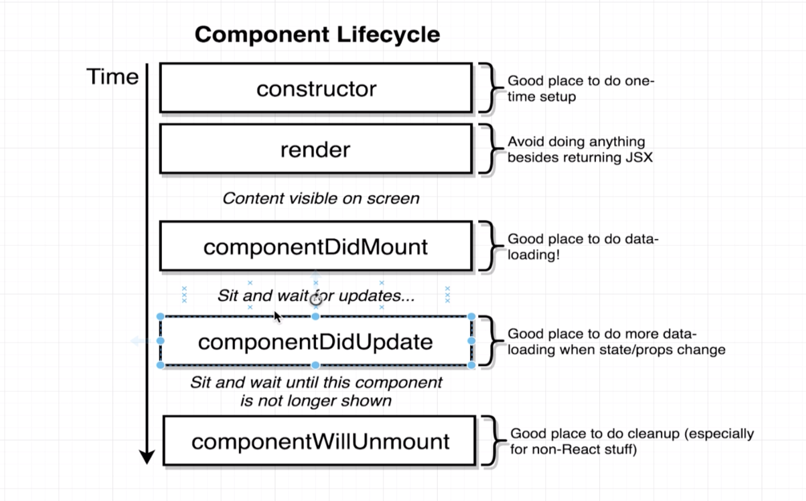
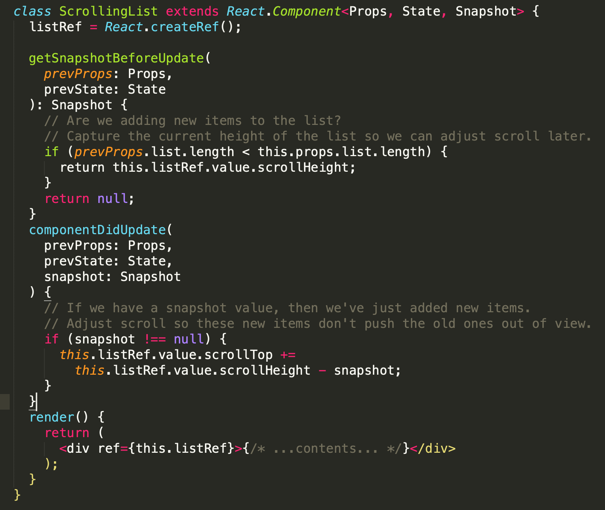

# React 总结

## **1.The pros of React and difference with Angular**

the pros of React: 

**reusability**: component can be repeated across several web pages

**virtual dom**: Through React’s memory reconciliation algorithm, the library constructs a representation of the page in a virtual memory, where it performs the necessary updates before rendering the final web-page into the browser. 

**One-direction**: data flow in ReactJS provides a stable code

**An open-source Facebook library**: constantly developing and open to the community

Wide **React and Redux toolset**

It's easy to know how a component is rendered, you just need to look at the render function. JSX makes it easy to read the code of your components. 

It's also really easy to see the layout, or how components are plugged/combined with each other. You can render React on the server-side. This enables improves SEO and performance. It's easy to test. 

You can use React with any framework \(Backbone.js, Angular.js\) as it's only a view layer.

**------------------------------------------------------------------------------------------------------**

The differences with Angular:

**library vs framework:**

A software framework \(be it front-end or backend\) includes standardized, pre-written code, which makes the development of certain functionalities easier and faster. You have less freedom to code, as you have to code as the framework architecture dictates.

A library is a collection of functions and functionalities, which you can use to achieve a certain end. You have more freedom to design and construct the system when using a library, but that adds more responsibility on the coder to be able to use it efficiently and find the right library for the right job, because, for projects which need to grow over time and become more serious, this could become significantly riskier and more difficult to manage.

The most significant difference between a framework and a library is how they interact with your code.

Your code calls the library while the framework calls your code.

This is also known as Inversion of Control. The litmus test for detecting a framework is checking if it has the Inversion of Control.

\*\*\*\*

#### **Data Binding:**

Angular allows two-way data binding while React allows one-way data binding.

Two-way data binding means that any changes you make to the model affect the view, and vice versa.

One-way data binding means any changes you make to the model affect the view, but not the other way around. This way, the data only flows in one direction.

#### **DOM Usage:**

Angular uses the browser's DOM, while React uses a virtual DOM.

A virtual DOM is a simplified version of the DOM. By using a virtual DOM, you can change any element very quickly and without needing to render the whole DOM. It drastically changes the performance from good to excellent.Using the virtual DOM is quite the buzz nowadays because it is faster, and speed is key!

#### **Language:**

Angularis a JS framework by nature, but is built to use TypeScript. React, on the other hand, is a JavaScript library as well, but recommends using JSX.

#### **Learning Curve:**

On average, TypeScript is considered harder to learn than JSX, in turn increasing the learning curve with Angular as compared to React.

#### **App Structure:**

Angular is a fully-featured MVC framework. React is just more of a 'V' in the MVC.


## **2.what is hoc and when to use**

A higher-order component \(HOC\) is an advanced technique in React for reusing component logic. HOCs are not part of the React API, per se. They are a pattern that emerges from React’s compositional nature.

A higher-order component is a function that takes a component and returns a new component, for the concept of resuable component.

#### High Order Component Pattern <a id="high-order-component-pattern"></a>

```text
import React, { Component } from 'react';

const higherOrderComponent = OldComponnet => {
  class NewComponent extends Component {
    render() {
      return <OldComponnet />;
    }
  }
  return NewComponent;
};
```


#### Basic Example - Localization <a id="basic-example---localization"></a>

In order to implement the localization in the application, we need to share some common data across all components.

```text
// hoc for localization strings
const withLocalization = OldComponent => {
  class NewComponent extends Component {
    render() {
      const template = {
        en: {
          hello: 'hello',
          bye: 'bye'
        },
        cn: {
          hello: '你好',
          bye: '再见'
        }
      };
      // get the language from this.props
      // use en by default
      const lang = this.props.lang || 'en';
      const localizationString = template[lang];
      return <OldComponent localizationString={localizationString} />;
    }
  }
  return NewComponent;
};

// use hoc for Text and Button

const WithLocalizationButton = withLocalization(Button);
const WithLocalizationText = withLocalization(Text);

// app component
class App extends Component {
  render() {
    return (
      <div>
        <WithLocalizationButton />
        <WithLocalizationText />
      </div>
    );
  }
}

// Text component
function Text(props) {
  return (
    <p>{props.localizationString ? props.localizationString.hello : ''}</p>
  );
}
// Button component
function Button(props) {
  return (
    <button>
      {props.localizationString ? props.localizationString.bye : ''}
    </button>
  );
}
```


## **3.react render function**

\*\*\*\*

  
The `render()` method is the only required method in a class component.

When called, it should examine `this.props` and `this.state` and return one of the following types:

* **React elements.** Typically created via [JSX](https://reactjs.org/docs/introducing-jsx.html). For example, `<div />` and `<MyComponent />` are React elements that instruct React to render a DOM node, or another user-defined component, respectively.
* **Arrays and fragments.** Let you return multiple elements from render. See the documentation on [fragments](https://reactjs.org/docs/fragments.html) for more details.
* **Portals**. Let you render children into a different DOM subtree. See the documentation on [portals](https://reactjs.org/docs/portals.html) for more details.
* **String and numbers.** These are rendered as text nodes in the DOM.
* **Booleans or `null`**. Render nothing. \(Mostly exists to support `return test && <Child />` pattern, where `test` is boolean.\)

The `render()` function should be pure, meaning that it does not modify component state, it returns the same result each time it’s invoked, and it does not directly interact with the browser.

If you need to interact with the browser, perform your work in `componentDidMount()` or the other lifecycle methods instead. Keeping `render()` pure makes components easier to think about.

> Note
>
> `render()` will not be invoked if [`shouldComponentUpdate()`](https://reactjs.org/docs/react-component.html#shouldcomponentupdate) returns false.

\*\*\*\*

## **4.**reactDomServer

The ReactDOMServer object enables you to render components to static markup. Typically, it’s used on a Node server:

**a.**

Render a React element to its initial HTML. React will return an HTML string. You can use this method to generate HTML on the server and send the markup down on the initial request for faster page loads and to allow search engines to crawl your pages for SEO purposes.

```text
ReactDOMServer.renderToString(element)

```

b.

Similar to [`renderToString`](https://reactjs.org/docs/react-dom-server.html#rendertostring), except this doesn’t create extra DOM attributes that React uses internally, such as `data-reactroot`. This is useful if you want to use React as a simple static page generator, as stripping away the extra attributes can save some bytes.

If you plan to use React on the client to make the markup interactive, do not use this method. Instead, use [`renderToString`](https://reactjs.org/docs/react-dom-server.html#rendertostring) on the server and [`ReactDOM.hydrate()`](https://reactjs.org/docs/react-dom.html#hydrate) on the client.

```text
ReactDOMServer.renderToStaticMarkup(element)

```

## 5.**what is state, setState**

**state:**

The state of a React component is a place to store data inside the component. It is similar to a Javascript Object, but it is immutable.

A component's state should be considered as private data. This data is not exposed to the component that makes use of it. It is private and fully controlled by the component. It is only seen on the inside of component definitions. You can think of state as an internal data-set which affects the rendering of components.

Only Class Component has state, functional Component does not.

**setState: help to change the state value**

**why we need this method?**

When you use `this.state.color = 'red';` you mutate the state, it will not trigger re-render.

`this.setState({color: 'red'})` will create a new state and assign it to `this.state` changing it in an immutable way, thus React will know it has changed and will re-render the component.

#### Three important principles of setting state <a id="three-important-principles-of-setting-state"></a>

* Do not **modify** state directly, use `setState()` instead. The only place you can assign value to `this.state` is in the constructor.
* `setState()` may be asynchronous.
* State updates are merged.

## **6.life cycle methods**

Each React component has several “lifecycle methods” that you can override to run code at particular times in the process. Methods _prefixed with will_ are called right before something happens, and methods _prefixed with did_ are called right after something happens.

Through lifecycle methods, we can then control what happens when each tiny section of your UI renders, updates, thinks about re-rendering, and then disappears entirely.

**constructor:**

  ****The constructor for a React component is called before it is mounted. When implementing the constructor for a React.Component subclass, you should call super\(props\) before any other statement. Otherwise, this.props will be undefined in the constructor, which can lead to bugs.

**componentDidMount\(\):**

  ****componentDidMount\(\) is invoked immediately after a component is mounted.

**shouldComponentUpdate\(nextProps, nextState\):**

shouldComponentUpdate\(\) is invoked before rendering when new props or state are being received. Defaults to true. Use shouldComponentUpdate\(\) to let React know if a component’s output is not affected by the current change in state or props.

Use `shouldComponentUpdate()` to let React know if a component’s output is not affected by the current change in state or props. The default behavior is to re-render on every state change, and in the vast majority of cases you should rely on the default behavior.

**componentDidUpdate\(prevProps, prevState\):**

  ****componentDidUpdate\(\) is invoked immediately after updating occurs.

**componentWillUnmonut\(\):**

  ****componentWillUnmount\(\) is invoked immediately before a component is unmounted and destroyed.

```text
import React from "react";
import ReactDOM from "react-dom";
import { Component } from 'react';


import "./styles.css";

class App extends Component {
  constructor(props) {
    console.log('constructor called.');
    super(props);
    this.state = {number: 1};
  }

  componentDidMount() {
    console.log('componentDidMount() called.');
  }

  shouldComponentUpdate(nextProps, nextState) {
    console.log('shouldComponentUpdate() called.');
    console.log('current props: ', this.props);
    console.log('next props: ', nextProps);
    console.log('current state: ', this.state);
    console.log('next state: ', nextState);
    return true;
  }

  componentDidUpdate(prevProps, prevState) {
    console.log('componentDidUpdate() called.');
    console.log('current props: ', this.props);
    console.log('previous props: ', prevProps);
    console.log('current state: ', this.state);
    console.log('previous state: ', prevState);
  }
  componentWillUnmonut() {
    console.log('componentWillUnmonut() called.');
  }
  addOne = () => {
    this.setState({number: this.state.number + 1});
  };
  render() {
    console.log('render() called.');
    return (
      <div>
        <p>{this.state.number}</p>
        <button onClick={this.addOne}>Add One</button>
      </div>
    );
  }
}

const rootElement = document.getElementById("root");
ReactDOM.render(<App />, rootElement);

```


\*\*\*\*

_\*\*\*\*_

## **7. life cycle 的顺序**



initial loading:

constructor called. 

render\(\) called.

 componentDidMount\(\) called. \(only once\)

component changes:

shouldComponentUpdate\(\) called.\(if there is any\)

then 

componentDidUpdate\(\) called.\(every time when state/props changes\)

## **8.Why react has good performance**

**React’s** use of a **virtual DOM** is one of its features that makes it so blazingly fast.  A **virtual DOM** only looks at the differences between the previous and current HTML and changes the part that is required to be updated. 


Conversely, Angular opted to use a **regular DOM.** This will update the entire tree structure of HTML tags until it reaches the user’s age.  


#### **React Fiber: \(after version 16\)**

With Fiber, react can pause and resume work as it sees fit to get what matters onto the screen as quickly as possible. I

\*\*\*\*

## **9. Difference between framework and libraries**

**library vs framework:**

A software framework \(be it front-end or backend\) includes standardized, pre-written code, which makes the development of certain functionalities easier and faster. You have less freedom to code, as you have to code as the framework architecture dictates.

A library is a collection of functions and functionalities, which you can use to achieve a certain end. You have more freedom to design and construct the system when using a library, but that adds more responsibility on the coder to be able to use it efficiently and find the right library for the right job, because, for projects which need to grow over time and become more serious, this could become significantly riskier and more difficult to manage.

The most significant difference between a framework and a library is how they interact with your code.

Your code calls the library while the framework calls your code.

This is also known as Inversion of Control. The litmus test for detecting a framework is checking if it has the Inversion of Control.

## **10.props and state**

Props is shorthand for properties, and Props are how components talk to each other by passing values around.

**class components:**

```text
import React, {Component} from 'react';

class Text extends Component {
  render() {
    console.log(this.props);
    // {
    //   text: "Hello World."
    // }
    return <p>{this.props.text}</p>;
  }
}

class App extends Component {
  render() {
    return <Text text="Hello World." />;
  }
}
```

**function component:**

```text
import React, {Component} from 'react';

function Text(props) {
  console.log(props);
  // {
  //   text: "Hello World."
  // }
  return <p>{props.text}</p>;
}
function App(props) {
  return <Text text="Hello World." />;
}
```

## **11.end-to-end test tool and unit test tool**

## **12.**PropTypes**?**


As your app grows, you can catch a lot of bugs with typechecking. For some applications, you can use JavaScript extensions like Flow or TypeScript to typecheck your whole application. But even if you don’t use those, React has some built-in typechecking abilities. To run typechecking on the props for a component, you can assign the special propTypes property:

Before we use `React.PropTypes` to do the typechecking. Since React v15.5, it has been moved into a different package called `prop-types`.

To insatll `prop-types`:

```text
npm install prop-types --save
```

Example:

```text
import React, {Component} from 'react';
import PropTypes from 'prop-types';

class TextA extends Component {
  render() {
    return <p>Hello, {this.props.text}</p>;
  }
}

const TextB = props => {
  return <p>Hello, {props.text}</p>;
};

TextA.propTypes = {
  text: PropTypes.string,
};

TextB.propTypes = {
  text: PropTypes.string,
};
```

Here is a list of all available types:

```text
MyComponent.propTypes = {
  // You can declare that a prop is a specific JS type. By default, these
  // are all optional.
  optionalArray: PropTypes.array,
  optionalBool: PropTypes.bool,
  optionalFunc: PropTypes.func,
  optionalNumber: PropTypes.number,
  optionalObject: PropTypes.object,
  optionalString: PropTypes.string,
  optionalSymbol: PropTypes.symbol,

  // Anything that can be rendered: numbers, strings, elements or an array
  // (or fragment) containing these types.
  optionalNode: PropTypes.node,

  // A React element.
  optionalElement: PropTypes.element,

  // You can also declare that a prop is an instance of a class. This uses
  // JS's instanceof operator.
  optionalMessage: PropTypes.instanceOf(Message),

  // You can ensure that your prop is limited to specific values by treating
  // it as an enum.
  optionalEnum: PropTypes.oneOf(['News', 'Photos']),

  // An object that could be one of many types
  optionalUnion: PropTypes.oneOfType([
    PropTypes.string,
    PropTypes.number,
    PropTypes.instanceOf(Message)
  ]),

  // An array of a certain type
  optionalArrayOf: PropTypes.arrayOf(PropTypes.number),

  // An object with property values of a certain type
  optionalObjectOf: PropTypes.objectOf(PropTypes.number),

  // An object taking on a particular shape
  optionalObjectWithShape: PropTypes.shape({
    color: PropTypes.string,
    fontSize: PropTypes.number
  }),

  // You can chain any of the above with `isRequired` to make sure a warning
  // is shown if the prop isn't provided.
  requiredFunc: PropTypes.func.isRequired,

  // A value of any data type
  requiredAny: PropTypes.any.isRequired,

```

##  **13.Can react work with angular.js? What’s the problem of doing that?**

##  **15.What is component and Props?**

React components are like JavaScript functions. They accept arbitrary inputs \(called “props”\) and return React elements describing what should appear on the screen.

Building a React project involves creating one or more React components that can interact with each other. A React component is simply a JavaScript class that requires the render function to be declared. The render function simply outputs HTML code, which is implemented using either JSX. A React component may also require additional functions for handling data, actions and lifecycle events.

React components can further be categorized into containers/stateful components and stateless components. A stateless component’s work is simply to display data that it receives from its parent React component. It can also receive events and inputs, which it passes up to its parent to handle. A React container or stateful component does the work of rendering one or more child components. It fetches data from external sources and feeds it to its child components. It also receives inputs and events from them in order to initiate actions.

Components let you split the UI into independent, reusable pieces, and think about each piece in isolation.

**Props:**

Props is shorthand for properties, and Props are how components talk to each other by passing values around.

## **16.**ReactDOM.render\(, document.getElementById\('root'\)\) ?

* We call ReactDOM.render\(\) with the `<App />` component, to render `<App />` inside `<div id="root"></div>`.
* Our App component returns a `<div>Hello World!!!</div>` as the result.
* React DOM efficiently updates the HTML DOM to match `<div>Hello World!!!</div>`.

##  **17.How to handle event in react\(2 kinds?\)?**

a.

```text
class Toggle extends React.Component {
  constructor(props) {
    super(props);
    this.state = {isToggleOn: true};

    // This binding is necessary to make `this` work in the callback
    this.handleClick = this.handleClick.bind(this);
  }

  handleClick() {
    this.setState(prevState => ({
      isToggleOn: !prevState.isToggleOn
    }));
  }

  render() {
    return (
      <button onClick={this.handleClick}>
        {this.state.isToggleOn ? 'ON' : 'OFF'}
      </button>
    );
  }
}

ReactDOM.render(
  <Toggle />,
  document.getElementById('root')
);
```

b. arrow function

```text
class Toggle extends React.Component {
  constructor(props) {
    super(props);
    this.state = {isToggleOn: true};

    // This binding is necessary to make `this` work in the callback
    // this.handleClick = this.handleClick.bind(this);
  }

  handleClick = () => {
    this.setState(prevState => ({
      isToggleOn: !prevState.isToggleOn
    }));
  }

  render() {
    return (
      <button onClick={this.handleClick}>
        {this.state.isToggleOn ? 'ON' : 'OFF'}
      </button>
    );
  }
}

ReactDOM.render(
  <Toggle />,
  document.getElementById('root')
);
```

## **18.what life cycle to do async calls**

componentDidMount\(\)**;**

##  19.**what is ref, give a scenario using ref**

Refs provide a way to access DOM nodes or React elements created in the render method.

In the typical React dataflow, [props](https://reactjs.org/docs/components-and-props.html) are the only way that parent components interact with their children. To modify a child, you re-render it with new props. However, there are a few cases where you need to imperatively modify a child outside of the typical dataflow. **The child to be modified could be an instance of a React component, or it could be a DOM element.** For both of these cases, React provides an escape hatch.

####  <a id="when-to-use-refs"></a>

#### When to use Refs <a id="when-to-use-refs"></a>

There are a few good use cases for refs:

* Managing focus, text selection, or media playback.
* Triggering imperative animations.
* Integrating with third-party DOM libraries.

**Avoid using refs for anything that can be done declaratively.**

\*\*\*\*

* When the `ref` attribute is used on an HTML element, the `ref` created in the constructor with `React.createRef()` receives the underlying DOM element as its `current` property.
* When the `ref` attribute is used on a custom class component, the `ref` object receives the mounted instance of the component as its `current`.

**???**

\*\*\*\*


## **20.how to communicate between parent and child component?**

```text
import ReactDOM from "react-dom";

import React, { Component } from 'react';

class Parent extends React.Component {
  constructor(props) {
    super(props);

    this.state = {
      fieldVal: ""
    }
  }

  onUpdate = (val) => {
    this.setState({
      fieldVal: val
    })
  };

  render() {
    return (
      <div>
        <h2>Parent</h2>
        Value in Parent Component State: {this.state.fieldVal}
        <br/>
        <Child onUpdate={this.onUpdate} />
        <br />
        <OtherChild passedVal={this.state.fieldVal} />
      </div>
    )
  }
}

class Child extends React.Component {
  constructor(props) {
    super(props);

    this.state = {
      fieldVal: ""
    }
  }

  update = (e) => {
    console.log(e.target.value);
    this.props.onUpdate(e.target.value);
    this.setState({fieldVal: e.target.value});
  };

  render() {
    return (
      <div>
        <h4>Child</h4>
        <input
          type="text"
          placeholder="type here"
          onChange={this.update}
          value={this.state.fieldVal}
        />
      </div>
    )
  }
}

class OtherChild extends React.Component {
  render() {
    return (
      <div>
        <h4>OtherChild</h4>
        Value in OtherChild Props: {this.props.passedVal}
      </div>
    )
  }
}

const rootElement = document.getElementById("root");
ReactDOM.render(<Parent />, rootElement);

```

## 22.**forceUpdate? when to use that?**

By default, when your component’s state or props change, your component will re-render. If your `render()` method depends on some other data, you can tell React that the component needs re-rendering by calling `forceUpdate()`.

Calling `forceUpdate()` will cause `render()` to be called on the component, skipping `shouldComponentUpdate()`. This will trigger the normal lifecycle methods for child components, including the `shouldComponentUpdate()` method of each child. React will still only update the DOM if the markup changes

\*\*\*\*

## **23.when to choose library/framework & why?**

**library\(react\) is good for:**

* **Dynamic Applications:** React will be a great choice because it uses a virtual DOM. It can quickly incorporate and "react" to the data changes made in the view by the users.
* **Single Page Apps:** React will be a great solution because it can display all changes made to the content without reloading the current page.
* **Native Mobile Apps:** If you wish to create a native mobile app, there is nothing better than React Native. You will be creating apps written in JavaScript with equal performance and feel of apps created in Java or Objective-C. **Angular** is ideal if you have a large application and you need strict code structure and base.

framework is good for:


* **Cross-platform Mobile Apps:** Angular 2 has great support for mobile apps, as it was created for that very purpose. It addresses limiting factors such as navigation via touch, different screen sizes, and mobile hardware.
* **Enterprise Software:** Because Angular uses an MVC architecture, it is great for creating enterprise level apps.
* **Progressive Web Apps and Hybrid Mobile Apps:** Angular 2, in combination with Ionic 2, is a perfect tool for building hybrid apps. The same technology stack can be used for progressive web app development. Angular 2 \(and up\) comes with a mobile toolkit which makes developing mobile apps extremely easy and quick.


##  24.**react play as view, what is mvc structure?**


\*\*\*\*

* **Model** − The lowest level of the pattern which is responsible for maintaining data.
* **View** − This is responsible for displaying all or a portion of the data to the user.
* **Controller** − Software Code that controls the interactions between the Model and View.

MVC is popular as it isolates the application logic from the user interface layer and supports separation of concerns. Here the Controller receives all requests for the application and then works with the Model to prepare any data needed by the View. The View then uses the data prepared by the Controller to generate a final presentable response. The MVC abstraction can be graphically represented as follows.

##  **27.react 缺点**

High pace of development

 Poor documentation

 ‘HTML in my JavaScript!’ **–** JSX as a barrier

 Additional SEO hassle

## **28.angular优缺点**

Pros of AngularJS**:**

  **Two-way data binding**:Two-way data binding allowed engineers to reduce development time as it didn’t require writing additional code to provide continual View and Model synchronization

  **Directives.** This feature actually enabled the HTML extension mentioned above. 

   **Dependency injection.** Dependencies define how different pieces of code interact with each other and how the changes in one component impact the other ones. 

  **Community**

Cons of AngularJS**:**

  **Performance.** Dynamic applications didn’t always perform that well. Complex SPAs could be laggy and inconvenient to use due to their size.

  **Steep learning curve.** As AngularJS is a versatile instrument, there is always more than one way to complete any task. This has produced some confusion among engineers.

## **29.What part of the MVC pattern does ReactJS implement?** 

**V**

## 30.**What frameworks have you used in conjunction with ReactJS for routing, AJAX calls, and other Model and Controller functionality that is not provided by ReactJS?**

## **31. Explain what a Component is and how it is created.**

React components are like JavaScript functions. They accept arbitrary inputs \(called “props”\) and return React elements describing what should appear on the screen.

Building a React project involves creating one or more React components that can interact with each other. A React component is simply a JavaScript class that requires the render function to be declared. The render function simply outputs HTML code, which is implemented using either JSX. A React component may also require additional functions for handling data, actions and lifecycle events.

React components can further be categorized into containers/stateful components and stateless components. A stateless component’s work is simply to display data that it receives from its parent React component. It can also receive events and inputs, which it passes up to its parent to handle. A React container or stateful component does the work of rendering one or more child components. It fetches data from external sources and feeds it to its child components. It also receives inputs and events from them in order to initiate actions.

Components let you split the UI into independent, reusable pieces, and think about each piece in isolation.

**function component:**

```text
function Welcome(props) {
  return <h1>Hello, {props.name}</h1>;
}
```

 **class component:**

```text
class Welcome extends React.Component {
  render() {
    return <h1>Hello, {this.props.name}</h1>;
  }
}
```

**Pass data between function components:**

```text
function Welcome(props) {
  return <h1>Hello, {props.name}</h1>;
}

function App() {
  return (
    <div>
      <Welcome name="Sara" />
      <Welcome name="Cahal" />
      <Welcome name="Edite" />
    </div>
  );
}

ReactDOM.render(
  <App />,
  document.getElementById('root')
);
```

## **32.which function  would you write when you wanna get data from server?**

```text
export const getUsers = () => dispatch => {
  // console.log(userData);
  axios
    .get("/api/users/all")
    .then(res =>
      dispatch({
        type: GET_USERS,
        payload: res.data
      })
    )
    .catch(err =>
      dispatch({
        type: GET_USERS,
        payload: null
      })
    );
};
```

## **33.what is the data binding advantage for ReactJS and AngularJs**

\*\*\*\*

\*\*\*\*

## **34.http request with different method\(put, get, delete,\) and status**

GET The GET method requests a representation of the specified resource. Requests using GET should only retrieve data.

 HEAD The HEAD method asks for a response identical to that of a GET request, but without the response body.

 POST The POST method is used to submit an entity to the specified resource, often causing a change in state or side effects on the server. 

PUT The PUT method replaces all current representations of the target resource with the request payload.

DELETE The DELETE method deletes the specified resource

. CONNECT The CONNECT method establishes a tunnel to the server identified by the target resource.

OPTIONS The OPTIONS method is used to describe the communication options for the target resource. 

TRACE The TRACE method performs a message loop-back test along the path to the target resource.

PATCH The PATCH method is used to apply partial modifications to a resource.

返回的状态码和状态不一致的情况是有可能发生得 比如Web应用程序内部错误，但仍然返回 200 OK

200 OK 请求正常处理完毕 

204 No Content 请求成功处理，没有实体的主体返回 206 Partial Content GET范围请求已成功处理 

301 Moved Permanently 永久重定向，资源已永久分配新URI 302 Found 临时重定向，资源已临时分配新URI

 303 See Other 临时重定向，期望使用GET定向获取 304 Not Modified 发送的附带条件请求未满足 3

07 Temporary Redirect 临时重定向，POST不会变成GET 400 Bad Request 请求报文语法错误或参数错误 

401 Unauthorized 需要通过HTTP认证，或认证失败 

403 Forbidden 请求资源被拒绝 

404 Not Found 无法找到请求资源（服务器无理由拒绝） 

500 Internal Server Error 服务器故障或Web应用故障 

503 Service Unavailable

服务器超负载或停机维护

## **300?400?500?200?都什么意思 其中server反应时间怎么看呢？多长时间返回数据从后端** 

## 35.**React, Redux 的关系图是什么样子的，白板给我画一下**


## **36.react+redux怎么传data，props怎么往上传，怎么跨页面传东西 如果不用redux怎么传    如果还不能用react怎么传     react router用法**

## **37.如果不用react，怎么储存传进来的一大堆数据 //dom，localStorege**

## **38.what is react.lazy\(\),** mapstatetoprops ,mapdispatchtoprops

The `React.lazy` function lets you render a dynamic import as a regular component.  


```text
const OtherComponent = React.lazy(() => import('./OtherComponent'));

function MyComponent() {
  return (
    <div>
      <OtherComponent />
    </div>
  );
}
```

mapstatetoprops_:_

`mapStateToProps` is used for selecting the part of the data from the store that the connected component needs. It’s frequently referred to as just `mapState` for short.

* It is called every time the store state changes.
* It receives the entire store state, and should return an object of data this component needs.

```text
function mapStateToProps(state) {
  const { todos } = state
  return { todoList: todos.allIds }
}

export default connect(mapStateToProps)(TodoList)
```

mapdispatchtoprops_:_

`mapDispatchToProps` is used for dispatching actions to the store.

`dispatch` is a function of the Redux store. You call `store.dispatch` to dispatch an action. This is the only way to trigger a state change.

[  
](https://react-redux.js.org/using-react-redux/connect-mapstate#defining-mapstatetoprops)

```text
const mapDispatchToProps = dispatch => {
  return {
    // dispatching plain actions
    increment: () => dispatch({ type: 'INCREMENT' }),
    decrement: () => dispatch({ type: 'DECREMENT' }),
    reset: () => dispatch({ type: 'RESET' })
  }
}
```

## _41. if I have a large json data response, what would you do to store in front end_

\*\*\*\*

_a._paginate your response data from serverside first to reduce the size of the json object.

b. parallel render then ui by chunk

c. don't do deep watch in the data if the data is too big, for example don't ngRepeat for too many data, if two way binding is not nessary. that will make your application very slow

## 42.**what is the react works in FLUX?**

\*\*\*\*

| Redux | Flex |
| :--- | :--- |
| one store | multiple store |
| multiple reducers | no reducer |
| implemented dispatch function | have to implement dispatch |
| library | pattern |
| implemented based on flux |  |

## 


## **44.what is JSX**

JSX is a syntax extension to JavaScript. It is similar to a template language, but it has full power of JavaScript. JSX gets compiled to `React.createElement()` calls which return plain JavaScript objects called “React elements”.

```text
// JSX
return (
    <div className="App"> 
        <h1>React</h1>
    </div>
);

// JavaScript
return React.createElement("div", {className: "App"}, 
    React.createElement("h1", null, "React"));
```

_Why JSX React_ **:**

embraces the fact that rendering logic is inherently coupled with other UI logic: how events are handled, how the state changes over time, and how the data is prepared for display. Instead of artificially separating technologies by putting markup and logic in separate files, React separates concerns with loosely coupled units called "components" that contain both.

## **45.element vs component**

Element vs Component

| Element | Component |
| :--- | :--- |
| the tag of an object representation of a DOM node | a function or a class which optionally accepts input and returns a React element |

## **46.React.createElement\(\)**

Create and return a new [React element](https://reactjs.org/docs/rendering-elements.html) of the given type. The type argument can be either a tag name string \(such as `'div'` or `'span'`\), a [React component](https://reactjs.org/docs/components-and-props.html) type \(a class or a function\), or a [React fragment](https://reactjs.org/docs/react-api.html#reactfragment) type.

Code written with [JSX](https://reactjs.org/docs/introducing-jsx.html) will be converted to use `React.createElement()`. You will not typically invoke `React.createElement()` directly if you are using JSX. See [React Without JSX](https://reactjs.org/docs/react-without-jsx.html) to learn more.

```text
React.createElement(
  type,
  [props],
  [...children]
)
```

\*\*\*\*

\*\*\*\*

## **48.state vs props**

**State** is referred to the local state of the component which cannot be accessed and modified outside of the component and only can be used & modified inside the component. **Props,** on the other hand, ****make components reusable by giving components the ability to receive data from the parent component in the form of props.  


\*\*\*\*

## **49.how to maintain state for your project**

## **50.second parameter in setState\(\)**

```text
setState(updater[, callback])

```

\*\*\*\*

## **51.how to output array in react**

```text
function ListItem(props) {
  // Correct! There is no need to specify the key here:
  return <li>{props.value}</li>;
}

function NumberList(props) {
  const numbers = props.numbers;
  const listItems = numbers.map((number) =>
    // Correct! Key should be specified inside the array.
    <ListItem key={number.toString()}
              value={number} />

  );
  return (
    <ul>
      {listItems}
    </ul>
  );
}

const numbers = [1, 2, 3, 4, 5];
ReactDOM.render(
  <NumberList numbers={numbers} />,
  document.getElementById('root')
);
```

## **52.what test method you use for React**

Jest and Enzyme


## **53.how to prevent a component from rendering**

* return null in the render method function
* return false in shouldComponentUpdate\(\) lifecycle method function in class based component

## **54.how to do auth in React**

Auth0

## **56. react state vs redux state, when do you use redux**

React state is stored locally within a component. When it needs to be shared with other components, it is passed down through props. 

When using Redux, state is stored globally in the Redux store. Any component that needs access to a value may subscribe to the store and gain access to that value. 

when to use redux:

**a.** Same piece of application state needs to be mapped to multiple container components.

b. Global components that can be accessed from anywhere.

c.Too many props are being passed through multiple hierarchies of components.

d.State management using setState is bloating the component.

f.Caching page state


## **57.write a router to route different component.**

React Router is the standard routing library for React. React Router keeps your UI in sync with the URL. It has a simple API with powerful features like lazy code loading, dynamic route matching, and location transition handling. 


#### Installation <a id="installation"></a>

React Router has been broken into three packages: react-router, react-router-dom, and react-router-native.

You should almost never have to install react-router directly. That package provides the core routing components and functions for React Router applications. The other two provide environment specific \(browser and react-native\) components.

```text
npm install react-router-dom --save
```

\*\*\*\*


#### Router <a id="router"></a>

There are two types of router in `react-router-dom`: the `<BrowserRouter>` and `<HashRouter>`. The `<BrowserRouter>` should be used when you have a server that will handle dynamic requests \(knows how to respond to any possible URI\), while the `<HashRouter>` should be used for static websites \(can only respond to requests for files that it knows about\). Usually it is preferable to use a `<BrowserRouter>`.

```text
// <BrowserRouter>
http://example.com/about
http://example.com/users

// <HashRouter>
http://example.com/#/about
http://example.com/#/users
```


#### Route <a id="route"></a>

The `<Route>` component is the most important component in React router. It renders some UI if the current location matches the route’s path. Ideally, a component should have a prop named path, and if the pathname is matched with the current location, it gets rendered.

Suppose we already have `<Home>`, `<About>`, `<Users>` three React components defined:

* You want to see the page rendering `<Home>` component if you go to the url `/`
* You want to see the page rendering `<About>` component if you go to the url `/about`
* You want to see the page rendering `<Users>` component if you go to the url `/users`

```text
import {BrowserRouter, Route} from 'react-router-dom';

/* Home component */
const Home = () => (
  <div>
    <h2>Home</h2>
  </div>
);

/* About component */
const About = () => (
  <div>
    <h2>About</h2>
  </div>
);

/* Users component */
const Users = () => (
  <div>
    <h2>Users</h2>
  </div>
);

class App extends React.Component {
  render() {
    return (
      <BrowserRouter>
        <div>
          <Route path="/" component={Home} />
          <Route path="/about" component={About} />
          <Route path="/users" component={Users} />
        </div>
      </BrowserRouter>
    );
  }
}
```


#### Link <a id="link"></a>

The `<Link>` component is used to navigate between pages. It’s comparable to the HTML anchor element. However, using anchor links would result in a browser refresh, which we don’t want. So instead, we can use to navigate to a particular URL and have the view re-rendered without a browser refresh.

```text
<Link to="/">Home</Link>
<Link to="/about">About</Link>
<Link to="/users">Users</Link>
```

In the example:

* We use the `<Link>` component to create a simple text UI, set "/" as the value of the `to` props, which will make the page go to `/` if you click it.
* We use the `<Link>` component to create a simple text UI, set "/about" as the value of the `to`props, which will make the page go to `/about` if you click it.
* We use the `<Link>` component to create a simple text UI, set "/users" as the value of the `to`props, which will make the page go to `/users` if you click it.

pitfall:

```text
import React, {Component} from 'react';
import {BrowserRouter, Route, Link} from 'react-router-dom';

/* Home component */
const Home = () => (
  <div>
    <h2>Home</h2>
  </div>
);

/* About component */
const About = () => (
  <div>
    <h2>About</h2>
  </div>
);

/* Users component */
const Users = () => (
  <div>
    <h2>Users</h2>
  </div>
);

/* App component */
class App extends Component {
  render() {
    return (
      <BrowserRouter>
        <div>
          <nav>
            <ul>
              <li>
                <Link to="/">Home</Link>
              </li>
              <li>
                <Link to="/about">About</Link>
              </li>
              <li>
                <Link to="/users">Users</Link>
              </li>
            </ul>
          </nav>
          <Route path="/" component={Home} />
          <Route path="/about" component={About} />
          <Route path="/users" component={Users} />
        </div>
      </BrowserRouter>
    );
  }
}
```


You will notice that there is a little bug in this demo: When you click `About` or `Users`, you can still see the text Home in the UI. This is because `/about` matches both `/` and `/about` and `/users`matches both `/` and `/users`. That's why you will see the extra "Home" text. If you want to avoid that and want a route to be rendered only if the path is exactly the same, you should use the `exact` props in `<Route>`.

```text
<Route exact={true} path="/" component={Home} />
<Route path="/about" component={About} />
<Route path="/users" component={Users} />
```

`<Switch>` component to your routes. With `<Switch>,` only the first child `<Route>` that matches the location gets rendered.

```text
import {BrowserRouter, Route, Link, Switch} from 'react-router-dom';

/* Home component */
const Home = () => (
  <div>
    <h2>Home</h2>
  </div>
);

/* About component */
const About = () => (
  <div>
    <h2>About</h2>
  </div>
);

/* Users component */
const Users = () => (
  <div>
    <h2>Users</h2>
  </div>
);
/* AnotherPage component */
const AnotherPage = () => (
  <div>
    <h2>Another Page</h2>
  </div>
);

/* App component */
class App extends Component {
  render() {
    return (
      <BrowserRouter>
        <div>
          <nav>
            <ul>
              <li>
                <Link to="/">Home</Link>
              </li>
              <li>
                <Link to="/about">About</Link>
              </li>
              <li>
                <Link to="/users">Users</Link>
              </li>
              <li>
                <Link to="/anotherPage">Another Page</Link>
              </li>
            </ul>
          </nav>
          <Switch>
            <Route exact={true} path="/" component={Home} />
            <Route path="/about" component={About} />
            <Route path="/users" component={Users} />
            <Route path="/:pageName" component={AnotherPage} />
          </Switch>
        </div>
      </BrowserRouter>
    );
  }
}
```

## 

## 59.**shouldComponentupdate.**

**when to use it.** 

**how to use it.**

**is this function check this state or next state.**

**how to check state changes.**

```text
 shouldComponentUpdate(nextProps, nextState) {
    return this.state.value !== nextState.value;
  }
```

  


## **61.前端怎么通过URL拿取json数据**

**using fetch and promise**

## **62. controlled components/ uncontrolled components.**

An input form element whose value is controlled by React is called a controlled component. When a user enters data into a controlled component a change event handler is triggered and your code decides whether the input is valid \(by re-rendering with the updated value\). If you do not re-render then the form element will remain unchanged. 

An uncontrolled component works like form elements do outside of React. When a user inputs data into a form field \(an input box, dropdown, etc\) the updated information is reflected without React needing to do anything. However, this also means that you can't force the field to have a certain value.

In most cases you should use controlled components. 

\*\*\*\*

\*\*\*\*

## **64.Prevent default**

The [`Event`](https://developer.mozilla.org/en-US/docs/Web/API/Event) interface's **`preventDefault()`** method tells the [user agent](https://developer.mozilla.org/en-US/docs/Glossary/user_agent) that if the event does not get explicitly handled, its default action should not be taken as it normally would be.

```text
document.querySelector("#id-checkbox").addEventListener("click", function(event) {
         document.getElementById("output-box").innerHTML += "Sorry! <code>preventDefault()</code> won't let you check this!<br>";
         event.preventDefault();
}, false);
```

then you cannot click on checkbox

## **69. Forward refs**

```text
// You can now get a ref directly to the DOM button
const ref = React.createRef();
<FancyButton ref={ref}>Click me!</FancyButton>;

const FancyButton = React.forwardRef((props, ref) => (
    // ref.current now point to the <button> DOM node
    <button ref={ref} {...props}> 
        {props.children}
    </button>
));
```

## **70. Error boundaries**

Error boundaries are React components that catch JavaScript errors anywhere in their child component tree, log those errors, and display a fallback UI instead of the component tree that crashed. Error boundaries catch errors during rendering, in lifecycle methods, and in constructors of the whole tree below them.

A class component becomes an error boundary if it defines either \(or both\) of the lifecycle methods `static getDerivedStateFromError()` or `componentDidCatch()`. Use `static getDerivedStateFromError()` to render a fallback UI after an error has been thrown. Use `componentDidCatch()` to log error information. 

Error Boundary does not catch errors for:

* Event handlers
* Asynchronous code
* Server side rendering
* Errors thrown in the error boundary itself

Errors that were not caught by any error boundary will result in unmounting of the whole React component tree.

## **71.class component vs function component，使用环境**

\*\*\*\*

| Class Component | Functional Component |
| :--- | :--- |
| allow you to use additional features like local state and lifecycle hooks | receive props and renders them to the page, can use pure function |
| to enable your component to have direct access to your store and thus holds state | also called stateless, dumb or presentational components |

## 

## **72.怎么提升react效率**

\*\*\*\*

* Use the Production Build
* Profiling Components with the Chrome Performance Tab
* Profiling Components with the DevTools Profiler
* Virtualize Long Lists
* Avoid Reconciliation
* shouldComponentUpdate in Action
* The Power Of Not Mutating Data
* Using Immutable Data Structures 

## **73.为什么要用redux，为什么不用context api**

Context API is built into React and you therefore need no extra third-party dependencies. e.g. You don't need a package like redux-thunk to handle asynchronous actions. 

The Context API is not built for high-frequency updates. It's only recommend for low-frequency updates \(e.g. theme changes, user authentication\) but not use it for the general state management of your application. 

\*\*\*\*

## **74.eject 用过吗**

**npm run eject上面提到，脚手架为了"优雅",隐藏了所有的webpack相关配置文件，如果我们想要基于原来的基础再次增加一些自己的东西，首先就要找到这些隐藏文件并且进行修改。**

**有的开发者直接到node\_modules中去搜索webpack.config...等文件，然后进行修改，修改后发现生效了，但是当修改后，我们又安装了一些其它项目模块，重新编译的时候，又回到了原有的配置信息\(很头疼的问题，总不能每一次安装新模块后，都重新改一次需要修改的配置吧...\)**

**基于create-react-app创建完成项目后，会提供一个eject命令\($ yarn eject\)，基于这个命令，可以把隐藏的webpack文件展示出来，方便我们二次进行配置。**

**$yarn eject或者npm run eject 此命令执行完成不可逆转\(慎重使用\)**

**执行完成后，我们可以看到原有的结构目录发生了一些变化\(新增两个文件夹,package.json中的内容也跟着发生改变\)**

  


## 75.**用哪个版本的react，新版本的新特性有哪些**

## 77.**sometime, response json file has empty field. how to do?**  

**hard to handle from front end**  


## 78.**reusable Component**

**问我, 听说你之前用过reusable Component, 能具体说说都是怎么用的吗? 我说用过的reusable Component里面,  button类型的用过的最多, 看她貌似不太满意, 我就又说form我也用过reusable Component, 并解释说reusable Component就类似一个Component的基本框架, 想要用的时候就添加新的feature或者function就行了, 如果想要使用的话, 任何8一个Component都可以是reusable Component, 看她貌似满意, 我就没再继续BB了**

## **79.然后问我Component, reducer和actionCreator之前怎么联系在一块的**

\*\*\*\*

## **80.解释React Hooks**

They let you use state and other React features without writing a class.

```text
import React, { useState } from 'react';

function Example() {
  // Declare a new state variable, which we'll call "count"
  const [count, setCount] = useState(0);

  return (
    <div>
      <p>You clicked {count} times</p>
      <button onClick={() => setCount(count + 1)}>
        Click me
      </button>
    </div>
  );
}
```

## **81.how many ways to create a react component?**

**follow up: what is the difference between functional component and class component.**

**which one has better performance do you think?**

**what is react hook? give an example （让我在白板上写react hook example代码, 因为上个问题回答答到了hook）**

**ways to create react components?**

**1.Using a Variable Function \(depreciated\)**

```text
var MyComponent = React.createClass({
   render() {
      return <div>
                <h1>Hello World!</h1>
                <p>This is my first React Component.</p>
             </div>
      }
})
```

**2.**Using a Class

```text
class MyComponent extends React.Component{
   render() {
      return <div>
                <h1>Hello World!</h1>
                <p>This is my first React Component.</p>
             </div>
      }
}
```

3.Using a Stateless Functional Component

```text
const MyComponent = () => {
      return <div>
                <h1>Hello World!</h1>
                <p>This is my first React Component.</p>
             </div>
      }
```

## **82.写个React Component去request一个list, 按她想要的做个mapping，很基本的东西。**


\*\*\*\*

## **83.what is synthetic event?**

Synthetic Event is a cross-browser wrapper around the browser's native event. It has the same interface as the browser's native event, including `stopPropagation()` and `preventDefault()`, except the events work identically across all browsers. 

## 

## **84.如何clean up event handler**

## **85.什么引起了react update?**

The component’s state changes

shouldComponentUpdate method


## **86.FLUX vs MVC**

MVC works both in server and client side development. MVC architecture: the user updates the controller, the controller manipulates the model, the model updates the view, and finally the user can see the view.

Flux is used for building client-side web applications. It implements React's com-posable view components by utilizing a unidirectional data flow. 

## **87.if you cannot render correctly, what will you do?**

**I talked about redux state check and the value of the states, Unit test ,and system test.**  


## **89.why we use root in React**

## **90.do you know react fibre**

**React Fiber** is an ongoing reimplementation of React's core algorithm, it’s just a **complete internal re-write of React**.

React Fiber is a complete, backwards compatible rewrite of the React core.

The goal of **React Fiber** is to increase its suitability for areas like animation, layout, and gestures. Its headline feature is incremental rendering: the ability to split rendering work into chunks and spread it out over multiple frames.

**React Fiber** is a virtual stack frame, with React Fiber being a reimplementation of a stack frame specialised for React components. Each fiber can be thought of as a virtual stack frame where information from the frame is preserved in memory on the heap, and because info is saved on the heap, you can control and play with the data structures and process the relevant information as needed.

## 91.**react fragment**

The `React.Fragment` component lets you return multiple elements in a `render()` method without creating an additional DOM element. You can also use it with the shorthand `<></>`syntax. 


## **92.tree shaking of react**

Tree-shaking is a concept in frontend development that involves the elimination of dead code or unused code. It depends on the static syntax of import and export modules in ES6 \(ES2015\). By taking tree-shaking concepts into consideration when writing code, we can significantly scale down the bundle size by getting rid of unused JavaScript, thereby optimizing the application and increasing its performance.

## **93.do you know something new about react like react pwa?**

\*\*\*\*

Progressive Web Apps are user experiences that have the reach of the web

* [**Reliable**](https://developers.google.com/web/progressive-web-apps/#reliable) - Load instantly and never show the downasaur, even in uncertain network conditions.
* [**Fast**](https://developers.google.com/web/progressive-web-apps/#fast) - Respond quickly to user interactions with silky smooth animations and no janky scrolling.
* [**Engaging**](https://developers.google.com/web/progressive-web-apps/#engaging) - Feel like a natural app on the device, with an immersive user experience.

## **94.** authentication **besides JWT**

## **97.react native vs react**

Reactjs is front end library developed by Facebook. It's used for handling view layer for web and mobile apps. ReactJS allows us to create reusable UI components. It is currently one of the most popular JavaScript libraries and it has strong foundation and large community behind it.

React Native is a mobile framework that compiles to native app components, allowing you to build native mobile applications \(iOS, Android, and Windows\) in JavaScript that allows you to use ReactJS to build your components, and implements ReactJS under the hood.

Both are open sourced by Facebook.

\*\*\*\*

## **98. what is container layer  in the redux? Container layer?**

store?

## **103.Event driven model**

event-driven programming a programming paradigm in which the flow of the program is determined by events such as user actions, sensor outputs, or messages from other programs or threads. 


\*\*\*\*

## **104.Difference between reactjs and jquery**

jQuery is a library for DOM manipulation, i.e. you would use it to access and modify existing HTML elements on a webpage.

React is a library for designing and rendering user interfaces. A big difference between the two is that React works through the "virtual DOM", which is basically just the data about the HTML elements rather than the elements themselves, whereas jQuery interacts with the DOM directly. The idea is that DOM elements carry around too much unnecessary data, and the virtual DOM abstracts the relevant parts, allowing for faster performance. In React, you modify the virtual DOM, which it then compares to the existing DOM elements and makes the necessary changes/updates.

## **105. Pure function**

a function where the return value is only determined by its input values, without observable side effects.  


## 106.**how to persist your data**

You can use sessionStorage or localStorage for it. Store whatever data you want to persist in storage. When you refresh the page get that data from storage in your constructor or componentWillMount \(UNSAFE\).


\*\*\*\*

## **107.What will happen if you do this.setState in render function**

  ****

You can not set state inside render function because it will cause side effect.

What exactly happens is that each time you update state react calls render function, so if you will update state inside render function then it will stuck inside infinite loop.

## **108.proptypes this is used validate the props that is fetched from the parent**

          **proptypes is a package**

##  **110. arguments of createStore\(\) ?**

 **\(reducer, \[preloadedState\], \[enhancer\]\)**

## **111.同时有2个Async calls，你怎么handle？一个接一个，or同时？**

**using** Promise.all

using async.parallel\(\)

## **112.How a button works from user Click to updates rendering on the page?**

\*\*\*\*

## **113.Write an easy helloWorld Component \(using codesandbox\)**

```text
class Welcome extends React.Component {
  render() {
    return <h1>Hello, {this.props.name}</h1>;
  }
}
```

## **114.**setState\(\) vs forceUpdated\(\)

| setState\(\) | forceUpdated\(\) |
| :--- | :--- |
| used to update the component state with one or more new state properties | a way to force re-render of the component and its children |
| a way of mutating the state and managing view updates | doesn't mutate the state at all |

## **115.**Props vs State

`Props` are inputs to a React component. They are data passed down from a parent component to a child component. Props are read only. 

`State` is an internal object for a particular react component and can change, as it determines the state of the component. It's not visible to other components.  

`props.children` contains the content between the opening and closing tags of a component.

only changes in `props` and/or `state` trigger React to re-render the components and potentially update the DOM in the browser. 

## 116.Two Kinds of Applications

| Single Page Applications | Multi Page Applications |
| :--- | :--- |
| Only ONE HTML Page, Content is \(re\)rendered on Client | Multiple HTML Pages, Content is rendered on Server. |
| Typically only ONE ReactDOM.render\(\) call | One ReactDOM.render\(\) call per "widget" |

## 117.Server-Side Rendering - pros & cons 


advantages:

* search engines can crawl the site for better SEO
* initial loading becomes faster
* great for static sites

disadvantages:

* frequent server requests
* full page reloads, overall slow page rendering
* non-rich site interactions

## 118.Client-Side Rendering - pros & cons


advantages:

* rich site interactions
* fast website rendering after the initial load
* great for web applications
* robust selection of JavaScript libraries

disadvantages:

* low SEO if not implemented correctly
* initial load might require more time
* in most cases, requires an external library

## 119.React.memo

`React.memo` is a higher order component. It's similar to `React.PureComponent` but for function components instead of classes. 

If your function component renders the same result given the same props, you can wrap it in a call to `React.memo` for a performance boost in some cases by memoizing the result. This means that React will skip rendering the component, and reuse the last rendered result. 

By default it will only shallowly compare complex objects in the props object. If you want control over the comparison, you can also provide a custom comparison function as the second argument. 

This method only exists as a performance optimization. 

## 120.Suspense

The suspense component shows the fallback content while you are waiting for the child components to load when the parent component renders. 

## 121.Why need super\(props\)

f you don't initialize state and you don't bind methods, you don't need to implement the constructor for your React component.

The constructor for a React component is called before it is mounted. When implementing the constructor for a React.component subclass, you should call super\(props\) before any other statement. Otherwise, `this.props` will be undefined in the constructor, which can lead to bugs.

## 122.Composition vs inheritance in React

React has a powerful composition model, and composition is recommended instead of inheritance to reuse code between components. 

## 123.Rendering Multiple Components

* You can build collections of elements and include them in JSX using curly braces {}.
* Using `<React.Fragment />`
* Return an array of elements using Map function and assign key to them 

## 124.Keys

A "key" is a special string attribute you need to include when creating arrays of elements. Keys help React identify which items have changed, are added, or are removed. Keys should be given to the elements inside an array to give the elements a stable identity. 

## 125.Steps for building React Project

* Break the UI into a Component Hierarchy
* Build a static version in React
* Identify the minimal \(but complete\) representation of UI state
* Identify where your state should live
* Add inverse Data Flow


## 126.The Diffing Algorithm


When diffing two trees, React first compares the two root elements. The behavior is different depending on the types of the root elements. 

React implements a heuristic O\(n\) algorithm based on two assumptions: 

* Two elements of different types will produce different trees
* The developer can hint at which child elements may be stable across different renders with a key prop.

## 127.Reconciliation

When a component's props or state change, React decides whether an actual DOM update is necessary by comparing the newly returned element with the previously rendered one. When they are not equal, React will update the DOM. This process is called Reconciliation. 

## 128.The Diffing Algorithm


When diffing two trees, React first compares the two root elements. The behavior is different depending on the types of the root elements. 

React implements a heuristic O\(n\) algorithm based on two assumptions: 

* Two elements of different types will produce different trees
* The developer can hint at which child elements may be stable across different renders with a key prop.

## 129.Shadow DOM

The Shadow DOM is a browser technology designed primarily for scoping variables and CSS in web components. 

## 130.Compilers - Babel

A JavaScript compiler takes JavaScript code, transforms it and returns JavaScript code in a different format. The most common use case is to take ES6 syntax and transform it into syntax that older browsers are capable of interpreting.

## 131.Bundlers - Webpack & Browserify

Bundlers take JavaScript and CSS code written as separate modules, and combine them together into a few files better optimized for the browsers. 

## 132.Package Managers - NPM & Yarn

Package managers are tools that allow you to manager dependencies in your project. 

## 133.Accessibility


* Semantic HTML
* Accessible Forms
* Focus Control
* Mouse and pointer events
* More Complex Widgets

## 134. life cycle


Lifecycle methods are various methods which are invoked at different phases of the lifecycle of a component.


Mounting 

* constructor\(\)
* static getDerivedStateFromProps\(\)
* render\(\)
* componentDidMount\(\) - runs after the component output has been rendered to the DOM. 

Updating

* static getDerivedStateFromProps\(\)
* shouldComponentUpdate\(\)
* render\(\)
* getSnapshotBeforeUpdate\(\)
* componentDidUpdate\(\)

Unmounting

* componentWillUnmount\(\)

Error Handling

* static getDerivedStateFromError\(\)
* componentDidCatch\(\)
* * **render** This is the required method in a React component, as this method prepares the element that gets mounted on to the browser DOM. This method is pure, which means it gives the same output every time the same input is provided. This method should not result in any side effect like changing state.
* **componentDidMount** This is the hook method which is invoked immediately after the component **did** mount on the browser DOM.  **Usage:** All the interaction directly with the browser DOM and integrate with third-party libraries like Highcharts or D3 should be done here. E.g This method is best to draw sound wave graphs of songs.
* _The API calls should be made in componentDidMount method always._


**Mounting**

In React realm mounting refers to the loading of components on the DOM. This phase contains a set of methods which get invoked when the component is getting initialized, and loaded on to the DOM.

* **constructor** This is the first method that gets called whenever a component is created. The constructor is called only once in the whole lifecycle of a component. It’s used to set up the initial values of variables and component state.  **Usage**_**:**_ ****Setup the initial state of the component.

**static getDerivedStateFromProps**  
As the name suggests **get**ting the **derived** **state from props** is used when the state is dependent on props, hence whenever the props are changed the state has to be kept in sync.  
This method is invoked after the constructor and is expected to return an object to update the state of the component. If null is returned then, nothing is changed in the state.

The method `getDerivedStateFromProps` is static, hence it has no access to `this`

**Updating**

This phase starts when the react component has taken birth on the browser and grows by receiving new updates. The component can be updated in two ways, sending new props from parents or updating the current state.

The list of methods that will get called in sequence when the update happens in either way:

* **static getDerivedStateFromProps** This method behaves exactly as defined above in mounting phase.
* **shouldComponentUpdate** This method tells React that when the component is being updated, it should re-render or skip rendering altogether. This method is a question, **should** the **Component** be **Updated**?  Hence this **method should return true or false,** and accordingly, the component would be re-rendered or skipped.  By default, this method returns **true.** _**Usage:**_ The example is one of the cases where the render is quite costly and we would like to re-render the component only when the props status changes.
* **render** And then the component gets rendered \(details in mounting phase\).
* **getSnapshotBeforeUpdate**

 ****



  
****This method gets called after the render created the React element and before it is actually updated from virtual DOM to actual DOM. This phase is known as `pre-commit` phase.

* This method has access to both previous and current props and state. If the method `getSnapshotBeforeUpdate` returns a value, the same is available in `componentDidUpdate` as the third parameter, where the UI can be updated to make is synced before and after render.  **Usage:** This method is useful if you want to keep sync in-between state of current DOM with the updated DOM. E.g. scroll position, audio/video, text-selection, cursor position, tool-tip position, etc.
* **componentDidUpdate** is executed when the newly updated component has been updated in the DOM. This method is used to re-trigger the third party libraries used, and to make sure these libraries also update and reload themselves.
*   **3\) Unmounting**

  In this phase, the component is not needed and the component will get unmounted from the DOM.  
  Below is the method called in this phase:

  * **componentWillUnmount** This method is the last method in the lifecycle. This is executed just before the component gets removed from the DOM. ****_**Usage:**_ In this method, we do all the cleanups related to the component.  For example, on log out, the user details and all the auth tokens can be cleared before unmounting the main component.


  
  


\*\*\*\*

  
  


  


  


\*\*\*\*

  


\*\*\*\*

\*\*\*\*

  


