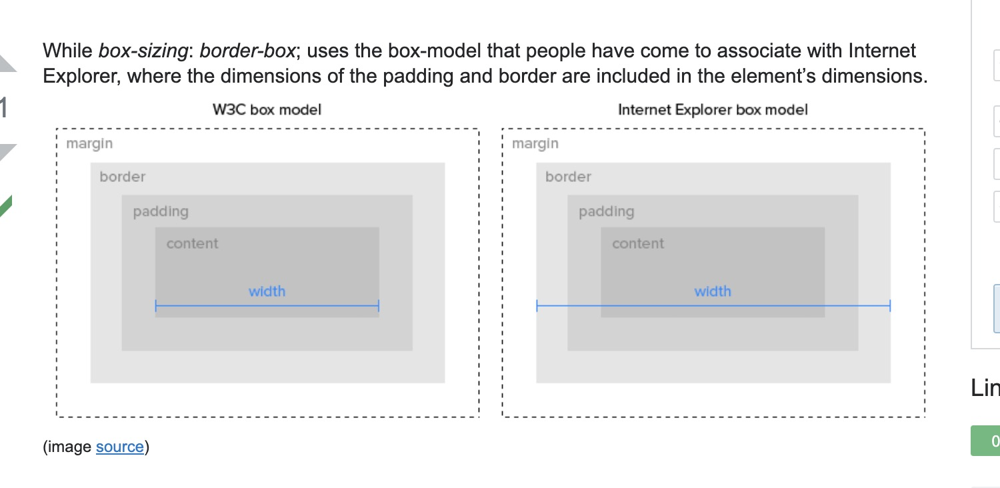

# 亚麻前端

## angular和react各自的优缺点?

react advantages:

* It's easy to know how a component is rendered, you just need to look at the render function.
* JSX makes it easy to read the code of your components. It's also really easy to see the layout, or how components are plugged/combined with each other.
* You can render React on the server-side. This enables improves SEO and performance. 
* It's easy to test.
* You can use React with any framework \(Backbone.js, Angular.js\) as it's only a view layer. 

react disadvantages:

* Learning curve. Being not full-featured framework it is requered in-depth knowledge for integration user interface free library into MVC framework.
* View-orientedness is one of the cons of ReactJS. It should be found 'Model' and 'Controller' to resolve 'View' problem.
* Not using isomorphic approach to exploit application leads to search engines indexing problems.
* Lots of developers dislike JSX React’s documentation, manuals are difficult for newcomers’ understanding.
* React’s large size library.


## what happens when you visit amazon?

step 1:The browser checks the cache for a DNS record to find the corresponding IP address of amazon.com

it needs to find 4 types of caches:

● First, it checks the browser cache. The browser maintains a repository of DNS records for a fixed duration for websites you have previously visited. So, it is the first place to run a DNS query. 

● Second, the browser checks the OS cache. If it is not found in the browser cache, the browser would make a system call \(i.e. gethostname on Windows\) to your underlying computer OS to fetch the record since the OS also maintains a cache of DNS records.

 ● Third, it checks the router cache. If it’s not found on your computer, the browser would communicate with the router that maintains its’ own cache of DNS records. 

● Fourth, it checks the ISP cache. If all steps fail, the browser would move on to the ISP. Your ISP maintains its’ own DNS server which includes a cache of DNS records which the browser would check with the last hope of finding your requested URL.


ps:

DNS\(Domain Name System\) is a database that maintains the name of the website \(URL\) and the particular IP address it links to. Every single URL on the internet has a unique IP address assigned to it. The IP address belongs to the computer which hosts the server of the website we are requesting to access. For an example, www.google.com has an IP address of 209.85.227.104. So if you’d like you can reach www.google.com by typing [http://209.85.227.104](http://209.85.227.104) on your browser. DNS is a list of URLs and their IP addresses just like how a phone book is a list of names and their corresponding phone numbers.


step2:If the requested URL is not in the cache, ISP’s DNS server initiates a DNS query to find the IP address of the server that hosts amazon.com.

ps:The purpose of a DNS query is to search multiple DNS servers on the internet until it finds the correct IP address for the website. This type of search is called a **recursive search** since the search will continue repeatedly from DNS server to DNS server until it either finds the IP address we need or returns an error response saying it was unable to find it.

These requests are sent using small data packets which contain information such as the content of the request and the IP address it is destined for \(IP address of the DNS recursor\). These packets travel through multiple networking equipment between the client and the server before it reaches the correct DNS server. This equipment use routing tables to figure out which way is the fastest possible way for the packet to reach its’ destination. If these packets get lost you’ll get a request failed error. Otherwise, they will reach the correct DNS server, grab the correct IP address, and come back to your browser.

example:


For maps.google.com, first, the DNS recursor will contact the root name server. The root name server will redirect it to **.com** domain name server. **.com** name server will redirect it to **google.com** name server. **google.com** name server will find the matching IP address for maps.google.com in its’ DNS records and return it to your DNS recursor which will send it back to your browser.  


step3:Browser initiates a TCP connection with the server

Once the browser receives the correct IP address it will build a connection with the server that matches IP address to transfer information. Browsers use internet protocols to build such connections. There are a number of different internet protocols which can be used but **TCP** is the most common protocol used for any type of HTTP request.

In order to transfer data packets between your computer\(client\) and the server, it is important to have a TCP connection established. This connection is established using a process called the **TCP/IP three-way handshake**. This is a three step process where the client and the server exchange SYN\(synchronize\) and ACK\(acknowledge\) messages to establish a connection.

 1. Client machine sends a SYN packet to the server over the internet asking if it is open for new connections. 

2. If the server has open ports that can accept and initiate new connections, it’ll respond with an ACKnowledgment of the SYN packet using a SYN/ACK packet.

 3. The client will receive the SYN/ACK packet from the server and will acknowledge it by sending an ACK packet.

Then a TCP connection is established for data transmission!

step4:The browser sends an HTTP request to the web server

Once the TCP connection is established, it is time to start transferring data! The browser will send a GET request asking for maps.google.com web page. If you’re entering credentials or submitting a form this could be a POST request. This request will also contain additional information such as browser identification \(User-Agent header\), types of requests that it will accept \(Accept header\), and connection headers asking it to keep the TCP connection alive for additional requests. It will also pass information taken from cookies the browser has in store for this domain.

step5:The browser sends an HTTP request to the web server.

Once the TCP connection is established, it is time to start transferring data! The browser will send a GET request asking for maps.google.com web page. If you’re entering credentials or submitting a form this could be a POST request. This request will also contain additional information such as browser identification \(User-Agent header\), types of requests that it will accept \(Accept header\), and connection headers asking it to keep the TCP connection alive for additional requests. It will also pass information taken from cookies the browser has in store for this domain.

step6:The server handles the request and sends back a http response

The server contains a web server \(i.e Apache, IIS\) which receives the request from the browser and passes it to a request handler to read and generate a response. The request handler is a program \(written in ASP.NET, PHP, Ruby, etc.\) that reads the request, its’ headers, and cookies to check what is being requested and also update the information on the server if needed. Then it will assemble a response in a particular format \(JSON, XML, HTML\).

The server response contains the web page you requested as well as the status code, compression type \(_Content-Encoding\)_, how to cache the page \(_Cache-Control_\), any cookies to set, privacy information, etc.

There are five types of statuses detailed using a numerical code.

● 1xx indicates an informational message only

● 2xx indicates success of some kind

● 3xx redirects the client to another URL

● 4xx indicates an error on the client’s part

● 5xx indicates an error on the server’s part

step7: The browser displays the HTML content \(for HTML responses which is the most common\)

The browser displays the HTML content in phases. First, it will render the bare bone HTML skeleton. Then it will check the HTML tags and sends out GET requests for additional elements on the web page, such as images, CSS stylesheets, JavaScript files etc. These static files are cached by the browser so it doesn’t have to fetch them again the next time you visit the page. At the end, you’ll see maps.google.com appearing on your browser.

## speed up website ?

Enable compression Use Gzip, a software application for file compression, to reduce the size of your CSS, HTML, and JavaScript files that are larger than 150 bytes.

Do not use gzip on image files. Instead, compress these in a program like Photoshop where you can retain control over the quality of the image. See "Optimize images" below.

Minify CSS, JavaScript, and HTML By optimizing your code \(including removing spaces, commas, and other unnecessary characters\), you can dramatically increase your page speed. Also remove code comments, formatting, and unused code. Google recommends using CSSNano and UglifyJS.

Reduce redirects Each time a page redirects to another page, your visitor faces additional time waiting for the HTTP request-response cycle to complete. For example, if your mobile redirect pattern looks like this: "example.com -&gt; www.example.com -&gt; m.example.com -&gt; m.example.com/home," each of those two additional redirects makes your page load slower.

Remove render-blocking JavaScript Browsers have to build a DOM tree by parsing HTML before they can render a page. If your browser encounters a script during this process, it has to stop and execute it before it can continue.

Google suggests avoiding and minimizing the use of blocking JavaScript.

Leverage browser caching Browsers cache a lot of information \(stylesheets, images, JavaScript files, and more\) so that when a visitor comes back to your site, the browser doesn't have to reload the entire page. Use a tool like YSlow to see if you already have an expiration date set for your cache. Then set your "expires" header for how long you want that information to be cached. In many cases, unless your site design changes frequently, a year is a reasonable time period. Google has more information about leveraging caching here.

Improve server response time Your server response time is affected by the amount of traffic you receive, the resources each page uses, the software your server uses, and the hosting solution you use. To improve your server response time, look for performance bottlenecks like slow database queries, slow routing, or a lack of adequate memory and fix them. The optimal server response time is under 200ms. Learn more about optimizing your time to first byte.

Use a content distribution network Content distribution networks \(CDNs\), also called content delivery networks, are networks of servers that are used to distribute the load of delivering content. Essentially, copies of your site are stored at multiple, geographically diverse data centers so that users have faster and more reliable access to your site.

Optimize images Be sure that your images are no larger than they need to be, that they are in the right file format \(PNGs are generally better for graphics with fewer than 16 colors while JPEGs are generally better for photographs\) and that they are compressed for the web.

Use CSS sprites to create a template for images that you use frequently on your site like buttons and icons. CSS sprites combine your images into one large image that loads all at once \(which means fewer HTTP requests\) and then display only the sections that you want to show. This means that you are saving load time by not making users wait for multiple images to load.


## What is Lazy Loading?

Lazy loading \(also called on-demand loading\) is an optimization technique for the online content, be it a website or a web app. Instead of loading the entire web page and rendering it to the user in one go as in bulk loading, the concept of lazy loading assists in loading only the required section and delays the remaining, until it is needed by the user. One form of lazy loading is infinity scroll, in which, the content of the web page is loaded as and when the user scrolls down the page. It is a popular technique being used by various websites.

Advantages of Lazy loading:

On-demand loading reduces time consumption and memory usage thereby optimizing content delivery. As only a fraction of the web page, which is required, is loaded first thus, the time taken is less and the loading of rest of the section is delayed which saves storage. All of this enhances the user’s experience as the requested content is fed in no time. Unnecessary code execution is avoided. Optimal usage of time and space resources makes it a cost-effective approach from the point of view of business persons. \(website owners\) Disadvantages of Lazy loading:

Firstly, the extra lines of code, to be added to the existing ones, to implement lazy load makes the code a bit complicated. Secondly, lazy loading may affect the website’s ranking on search engines sometimes, due to improper indexing of the unloaded content.

## HTML/JS event delegation?

　_**addEventListener\(event, listener, useCapture\)**_　　

useCapture : true: capturing,      useCapture = false : bubbling

Event delegation is a technique for listening to events where you _delegate_ a parent element as the listener for all of the events that happen inside it.

Event delegation is a technique involving adding event listeners to a parent element instead of adding them to the descendant elements. The listener will fire whenever the event is triggered on the descendant elements due to event bubbling up the DOM. 

The benefits of this technique are:

* Memory footprint goes down because only one single handler is needed on the parent element, rather than having to attach event handlers on each descendant.
* There is no need to unbind the handler from elements that are removed and to bind the event for new elements. 

For example, if you wanted to detect any time any field changed in value inside a specific form, you could do this:

```text
var form = document.querySelector('#hogwarts-application');

// Listen for changes to fields inside the form
form.addEventListener('input', function (event) {

	// Log the field that was changed
	console.log(event.target);

}, false);
```

## Bubbling?

When an event triggers on a DOM element, it will attempt to handle the vent if there is a listener attached, then the event is bubbled up to its parent and the same thing happens. The bubbling occurs up the element's ancestors all the way to the document. Event bubbling is the mechanism behind event delegation. 

var logEvent = function \(event\) { console.log\(event.target\); };

document.querySelector\('main'\).addEventListener\('input', logEvent, false\); document.querySelector\('div'\).addEventListener\('input', logEvent, false\); document.querySelector\('input'\).addEventListener\('input', logEvent, false\);

## capturing

[Here’s an example.](https://codepen.io/cferdinandi/pen/pqJZdK)

```text
document.addEventListener('focus', function (event) {
	console.log(event.target);
}, false);
```

You can focus on things over and over again, but the event callback will never run.

There’s a trick you can use to _capture_ the event, though. The last argument in `addEventListener()` is called `useCapture`. We almost always set it to false.

For events that don’t bubble, set it to `true` to capture the event anyways.

## Closure

A closure is an inner function that has access to the variables in the outer \(enclosing\) function's scope chain.  Closure is a function that returns a function. It gives the access to an outer function's scope from an inner function. To use the closure, simply define a function inside another function and return it or pass it to another function. 

The closure has access to variables in three scopes

* variables in its own scope
* variables in the enclosing function's scope
* global variables

We can use Closure to declare a private variable.

## Currying

Currying is a pattern where a function with more than one parameter is broken into multiple functions that, when called in series, will accumulate all of the required parameters one at a time. This technique can be useful for making code written in functional style easier to read and compose. It's important to node that for a function be curried, it needs to start out as one function, then broken out into a sequence of functions that each accepts one parameter.   


## CSS Selector


## CSS Priority

**CSS 优先规则1：** 最近的祖先样式比其他祖先样式优先级高。  
**CSS 优先规则2：**"直接样式"比"祖先样式"优先级高。  
**CSS 优先规则3：**优先级关系：内联样式 &gt; ID 选择器 &gt; 类选择器 = 属性选择器 = 伪类选择器 &gt; 标签选择器 = 伪元素选择器

* ID 选择器， 如 \#id{}
* 类选择器， 如 .class{}
* 属性选择器， 如 a\[href="segmentfault.com"\]{}
* 伪类选择器， 如 :hover{}
* 伪元素选择器， 如 ::before{}
* 标签选择器， 如 span{}
* 通配选择器， 如 \*{}

**CSS 优先规则4:** 算选择符中 ID 选择器的个数（a），计算选择符中类选择器、属性选择器以及伪类选择器的个数之和（b），计算选择符中标签选择器和伪元素选择器的个数之和（c）。按 a、b、c 的顺序依次比较大小，大的则优先级高，相等则比较下一个。若最后两个的选择符中 a、b、c 都相等，则按照"就近原则"来判断。

**CSS 优先规则5：**属性后插有 !important 的属性拥有最高优先级。若同时插有 !important，则再利用规则 3、4 判断优先级.

## const，let，var，scope


Variables declared using the `var` keyword are scoped to the function in which they are created, or if created outside of any function, to the global object. `let` and `const` are _block scoped_, meaning they are only accessible within the nearest set of curly braces \(function, if-else block, or for-loop\).

```text
function foo() {
  // All variables are accessible within functions.
  var bar = 'bar';
  let baz = 'baz';
  const qux = 'qux';

  console.log(bar); // bar
  console.log(baz); // baz
  console.log(qux); // qux
}

console.log(bar); // ReferenceError: bar is not defined
console.log(baz); // ReferenceError: baz is not defined
console.log(qux); // ReferenceError: qux is not defined
```

```text
if (true) {
  var bar = 'bar';
  let baz = 'baz';
  const qux = 'qux';
}

// var declared variables are accessible anywhere in the function scope.
console.log(bar); // bar
// let and const defined variables are not accessible outside of the block they were defined in.
console.log(baz); // ReferenceError: baz is not defined
console.log(qux); // ReferenceError: qux is not defined
```

`var` allows variables to be hoisted, meaning they can be referenced in code before they are declared. `let` and `const`will not allow this, instead throwing an error.

```text
console.log(foo); // undefined

var foo = 'foo';

console.log(baz); // ReferenceError: can't access lexical declaration 'baz' before initialization

let baz = 'baz';

console.log(bar); // ReferenceError: can't access lexical declaration 'bar' before initialization

const bar = 'bar';
```

Redeclaring a variable with `var` will not throw an error, but 'let' and 'const' will.

```text
var foo = 'foo';
var foo = 'bar';
console.log(foo); // "bar"

let baz = 'baz';
let baz = 'qux'; // Uncaught SyntaxError: Identifier 'baz' has already been declared
```

`let` and `const` differ in that `let` allows reassigning the variable's value while `const` does not.

```text
// This is fine.
let foo = 'foo';
foo = 'bar';

// This causes an exception.
const baz = 'baz';
baz = 'qux';
```


## this?


The value of `this` depends on how the function is called. 

The following rules are applied:

* If the `new` keyword is used when calling the function, `this` inside the function is a brand new object.
* If `apply`, `call` or `bind` are used to call/create a function, `this` inside the function is the object that is passed in as the argument. 
* If a function is called as a method, such as `obj.method()`, `this` here is the object that the function is a property of. 
* If a function is invoked as a free function invocation. meaning it was invoked without any of the conditions present above, `this` is the global object. In a browser, it is the `window` object. If in strict mode \(`"use strict"`\), `this` will be `undefined` instead of the global object. 
* If multiple of the above rules apply, the rule that is higher wins and will set the `this` value.
* If the function is an ES6 arrow function, it ignores all the rules above and receives the `this` value of its surrounding scope at the time it is created. 

## Get VS Post

The following table compares the two HTTP methods: GET and POST.

|  | GET | POST |
| :--- | :--- | :--- |
| BACK button/Reload | Harmless | Data will be re-submitted \(the browser should alert the user that the data are about to be re-submitted\) |
| Bookmarked | Can be bookmarked | Cannot be bookmarked |
| Cached | Can be cached | Not cached |
| Encoding type | application/x-www-form-urlencoded | application/x-www-form-urlencoded or multipart/form-data. Use multipart encoding for binary data |
| History | Parameters remain in browser history | Parameters are not saved in browser history |
| Restrictions on data length | Yes, when sending data, the GET method adds the data to the URL; and the length of a URL is limited \(maximum URL length is 2048 characters\) | No restrictions |
| Restrictions on data type | Only ASCII characters allowed | No restrictions. Binary data is also allowed |
| Security | GET is less secure compared to POST because data sent is part of the URL  Never use GET when sending passwords or other sensitive information! | POST is a little safer than GET because the parameters are not stored in browser history or in web server logs |
| Visibility | Data is visible to everyone in the URL | Data is not displayed in the URL |

## Box Models?

All HTML elements can be considered as boxes. In CSS, the term box model is used when talking about design and layout. The CSS box model is essentially a box that wraps around every HTML element. It consists of **margin, border, padding and context**.  





## Position

* Static
  * This is the default value, all the elements are in order as they appear in the document
* Fixed
  * The element is positioned relative to its normal position
  * This can be used to create a "floating" element that stays in the same position regardless of scrolling.
* Absolute
  * The element is positioned absolutely to its first positioned parent
  *  The absolutely positioned element is positioned relative to its _nearest positioned ancestor_ \(i.e., the nearest ancestor that is not `static`\).
* Relative
  * The element is positioned related to the browser window
  * their normal position within the document
* Sticky
  * The element is positioned based on the user's scroll position

## display: none vs hidden

`display:none` means that the tag in question will not appear on the page at all \(although you can still interact with it through the dom\). There will be no space allocated for it between the other tags.

`visibility:hidden` means that unlike `display:none`, the tag is not visible, but space is allocated for it on the page. The tag is rendered, it just isn't seen on the page.


## Position

* Static
  * This is the default value, all the elements are in order as they appear in the document
* Fixed
  * The element is positioned relative to its normal position
  * This can be used to create a "floating" element that stays in the same position regardless of scrolling.
* Absolute
  * The element is positioned absolutely to its first positioned parent
  *  The absolutely positioned element is positioned relative to its _nearest positioned ancestor_ \(i.e., the nearest ancestor that is not `static`\).
* Relative
  * The element is positioned related to the browser window
  * their normal position within the document
* Sticky
  * The element is positioned based on the user's scroll position


## page loading?

* Optimize Images
* Browser Caching 
* Compression
* Optimize Your CSS
* Keep the Scripts below the fold

window.onload

By default, it is fired when the entire page loads, including its content \(images, CSS, scripts, etc.\). In some browsers it now takes over the role of document.onload and fires when the DOM is ready as well.

document.onload

It is called when the DOM is ready which can be prior to images and other external content is loaded. How well are they supported? window.onload appears to be the most widely supported. In fact, some of the most modern browsers have in a sense replaced document.onload with window.onload.

Browser support issues are most likely the reason why many people are starting to use libraries such as jQuery to handle the checking for the document being ready, like so:

$\(document\).ready\(function\(\) { / _code here_ / }\); $\(function\(\) { / _code here_ / }\);


## flatten array

```javascript
flatten = (arr) => arr.reduce((flat, next) => flat.concat(Array.isArray(next) ? flatten(next) : next), [])
```

## flatten object

```javascript
/**
 * PRIVATE
 * Flatten a deep object into a one level object with it’s path as key
 *
 * @param  {object} object - The object to be flattened
 *
 * @return {object}        - The resulting flat object
 */
const flatten = object => {
  return Object.assign( {}, ...function _flatten( objectBit, path = '' ) {  //spread the result into our return object
    return [].concat(                                                       //concat everything into one level
      ...Object.keys( objectBit ).map(                                      //iterate over object
        key => typeof objectBit[ key ] === 'object' ?                       //check if there is a nested object
          _flatten( objectBit[ key ], `${ path }/${ key }` ) :              //call itself if there is
          ( { [ `${ path }/${ key }` ]: objectBit[ key ] } )                //append object with it’s path as key
      )
    )
  }( object ) );
};


const realDeepObject = {
  level1: {
    level2: {
      level3: {
        more: 'stuff', //duplicate key
        other: 'stuff',
        level4: {
          the: 'end',
        },
      },
    },
    level2still: {
      last: 'one',
    },
    am: 'bored',
  },
  more: 'stuff', //duplicate key
  ipsum: {
    lorem: 'latin',
  },
};

const flat = flatten( realDeepObject );

console.log( flat );
```

## 给定一个非负整数组成的数组，返回数组最大的3数之和.

## unflatten object

代码内容不算难。基本上是给了一个list of strings 然后要做一些transform。比如说给 \['abc.def', 'abc.123.456', '456'\]，需要return 一个object  
 {  
      abc: {  
            def: '',  
            123: { 456: ‍‌‌‌‍‍‌‍‌‌‌‌‍‍‍‍‌‌‌'' },  
      },  
      456: '',  
 }  
 可用recursion解 找'.' 就好。

算法题很简单: 给定一个非负整数组成的数组，返回数组最大的3数之和.  Practical Programming的题个人认为这个题目本身做起来已经很烦人了：给了一个HTML Markup: 大体意思是有多个form 每个form有自己的id，每个form有不定个数的input， input name的格式可能是name='foo.bar.baz'  也可能是name用JS写一个function，函数参数是任意一个form的ID，要求的输出格式是  
 {    
    foo:'',              
    { bar: baz }           
 }  
 如果name='foo.bar.‍‌‌‌‍‍‌‍‌‌‌‌‍‍‍‍‌‌‌baz.bwe',  要求的输出格式是  
 {  
   foo:bar ,  
 { baz: bwe }  
 } ??

  
 round 4, 先是2个BQ，然后Coding，给一个form，form里有不同的input，input里有个name property，要求按照name property里的path把form信息收集到一个json object里。比如&lt;form&gt;&lt;input type="text" name="foo.bar" value="a"&gt;&lt;/form&gt;, {foo: {bar: a}}. Followup问如果两个input的path重复怎么办，override吗？

```javascript
const f = (a) => {
  let b = a.split('.');
  let result = {};
  let temp;
  temp = result;
  for (let i = 0; i < b.length - 1; i++) {
    if (i >= b.length) {
      break;
    }
    temp[b[i]] = {};
    temp = temp[b[i]];
    temp[b[i]] = b[i + 1];
  }
  return result;
}
```

## 做一个tooltip widget。就是鼠标一hover上去可以弹出内容的

[https://codepen.io/cui73/pen/MWWYGBK](https://codepen.io/cui73/pen/MWWYGBK)

## coding排序有数字和英文字符的字符串，对每一部分排序后返回新的字符串，比如AYUKB17053UI903TBC，返回ABKUY01357IU039BCT

## 说这是亚麻某个展示物品的跑马灯，你实现一下。我说可以用React吗，他说可以。然后开始写。没有什么难的，注意需要翻页，一页显示5个。

[https://www.w3schools.com/howto/tryit.asp?filename=tryhow\_js\_slideshow\_gallery](https://www.w3schools.com/howto/tryit.asp?filename=tryhow_js_slideshow_gallery) 图片怎么并排？


## leetcode637

```javascript
class Solution {
      public List<Double> averageOfLevels(TreeNode root) {
        List<Double> list = new LinkedList<>();
        Queue<TreeNode> queue = new LinkedList<>();
        queue.offer(root);
        while (!queue.isEmpty()) {
            int count = queue.size();
            double sum = 0;
            for (int i = 0; i < count; i++) {
                TreeNode cur = queue.poll();
                sum += cur.val;
                if (cur.left != null) queue.offer(cur.left);
                if (cur.right != null) queue.offer(cur.right);
            }
            list.add(sum / count);
        }
        return list;
    }
}
```

## 机器人最短路径

```java
public static int removeObstacle(int numRows, int numColumns, List<List<Integer>> lot) {

  // record already visted coordinates
  boolean[][] visit = new boolean[numRows][numColumns];

  int result = 0;

  // control directions from left,right,up,down

  int[][] Directions = new int[][]{{1,0},{-1,0},{0,1},{0,-1}};

  Queue<int[]> que = new LinkedList<>();

  que.offer(new int[]{0,0});

  // main algorithm bfs
  while(!que.isEmpty()){
    int size = que.size();
    for(int i = 0; i < size; i++) {
      int[] current = que.poll();
      int x = current[0];
      int y = current[1];
      // conditions checking
      if (x < 0 || y<0 || x >= numRows || y >= numColumns || lot.get(x).get(y) == 0 || visit[x][y]){
        continue;
      }
      visit[x][y] = true;
      if (lot.get(x).get(y)  == 9) {
        return result;
      }
      // get current position's neighbors  and put them into queue
      for (int[] dir: Directions) {
        int nextX = dir[0] + x;
        int nextY = dir[1] + y;
        que.offer(new int[]{nextX,nextY});
      }
    }
    result++;
  }
  return - 1;
}
```


## Design a contact book \(add/edit/delete\)

[https://codepen.io/cui73/pen/PooweXL](https://codepen.io/cui73/pen/PooweXL)


## Currying

```text
函数柯里化问了一个挺经典的题目，如何设计一个function能够接受不限次数的参数调用，比如:

```
function add() {
// logic
}
add(1) // 1
add(1)(2) //3
add(1)(2)(3) //6 
// etc
```

function add (num) {
    // you have to name the function when you have unlimited arguments
    //  because you have to have the same function to keep passing down
    //  the example you gave used 'fn' but it's a poor naming convention
    function adder(n) {
      // if the next potential argument is falsey, we can exist and return accumulated sum
      if (!n) {
        return num;
      } else {
        // otherwise we keep a running sum by adding the newest argument to num
        //  we chain the process by returning our named function
        num += n;
        return adder;
      }
    }
  
    return adder;
}

// our function returns a function, so you have to call it. 
//  your example code uses `valueOf` so it would end up being
//  add(1)(2)(3).valueOf(). I have seen an interviewer show me 
//  that he/she wanted it to be called with the extra open/close paren
console.log(add(1)(2)(3)());
```

## Array.filter的polyfill


## anki flashcard follow up: 除了用cookie 怎么让页面保存用户留在了哪一面

实现5张flash cards 然后用storage保存每张卡片的status

## implement lodash set

[https://stackoverflow.com/questions/54733539/javascript-implementation-of-lodash-set-method](https://stackoverflow.com/questions/54733539/javascript-implementation-of-lodash-set-method)

## star rating widget\(must\)


如何让这个component支持0.5的step，比如打分2.5星  
 最后再Follow up: 如果一个页面上需要用很多个star ratings你要如何优化你的代码

实现amazon的star评分的UI，5个star，要求点击某一个star的时候，前几个star和这个star都改变颜色，用过amazon应该都见过这个，比如点击第三个star，前三个star都变色。蛋疼的事他prefer plain js和plain css，特马这个年代谁还写plain js和css，直接说不会，可以用react吗，他说行，但是又说了prefer plain。到这里我就觉得自己差不多挂了，毕竟closure和css specificity感觉是必须知道的，所以也不管那么多了，强行用了react。感觉写的没什么问题，也注意了代码分离。 follow up是hover的时候也实现点击一样的效果，但是在处理style的时候他要求用css控制前几个star的style不能用js。 大概知道要用类似 star:n-th-node\(\)

- The stars should initially appear grey and in a horizontal row

- When a user hovers over a star, that star and any previous stars should light up as yell‍‌‌‌‍‍‌‍‌‌‌‌‍‍‍‍‌‌‌ow

- When a user clicks on a star, their rating should be saved, and, when hovering away, the rated stars should remain lit


[https://codepen.io/jamesbarnett/pen/vlpkh](https://codepen.io/jamesbarnett/pen/vlpkh)

## 口述如何实现slideshow

[https://www.w3schools.com/howto/howto\_js\_slideshow.asp](https://www.w3schools.com/howto/howto_js_slideshow.asp)

## 如果打开页面发现是空白，你会如何debug

我说我会创建一个新账号测试看能不能重现，能的话看console，没有问题看network有没有都载入；有的话看是server还是client render，可以判断html载入的对不对，如果不对就是render问题，如果对就是css问题

## 最基础的树BFS，让按照每一层的结构最后log出来一个string

```text
"1
23
456
7"
 public void levelIterator(BiTree root)
  {
	  if(root == null)
	  {
		  return ;
	  }
	  LinkedList<BiTree> queue = new LinkedList<BiTree>();
	  BiTree current = null;
	  queue.offer(root);//将根节点入队
	  while(!queue.isEmpty())
	  {
		  current = queue.poll();//出队队头元素并访问
		  System.out.print(current.val +"-->");
		  if(current.left != null)//如果当前节点的左节点不为空入队
		  {
			  queue.offer(current.left);
		  }
		  if(current.right != null)//如果当前节点的右节点不为空，把右节点入队
		  {
			  queue.offer(current.right);
		  }
	  }
	  


```

## 第三个是问如果前端要做一个组件，保证放入大段文字可以卡在中间不挡住文字，组件传入图片和说明文字，随便用js、react还是什么写出来

文字过长的话可以用 overflow:hidden; text-overflow:ellipsis; 解决

## given an int array, find integers that appears odd number of times in array

```java
 int getOddOccurrence(int ar[], int ar_size)  
    { 
        int i; 
        int res = 0; 
        for (i = 0; i < ar_size; i++)  
        { 
            res = res ^ ar[i]; 
        } 
        return res; 
    } 
```


  


## 给一个无序数组，返回新的数组，数组里‍‌‌‌‍‍‌‍‌‌‌‌‍‍‍‍‌‌‌面是最大最小第二大第二小第三大第三小以此类推的顺序。方法是排序，对半拆分，反转后半段，按照11223344的顺序合成一个数组再返回。nlogn复杂度。题目就这么多。

## Implement Promise，具体要求和Promise一致，能够创建一个新的Promise，参数是一个entry function， entry function的参数是resolve和reject两个function，能够用then去chain，并且返回一个新的Promise。

[https://www.freecodecamp.org/news/how-to-implement-promises-in-javascript-1ce2680a7f51/](https://www.freecodecamp.org/news/how-to-implement-promises-in-javascript-1ce2680a7f51/)


## 用js class design一个车，可以加速减速

里面有加速和减速的方法，每执行一次，速度+1 或者 -1。

[https://medium.com/tech-tajawal/javascript-classes-under-the-hood-6b26d2667677](https://medium.com/tech-tajawal/javascript-classes-under-the-hood-6b26d2667677)

```javascript
class Vehicle {
  constructor(make) {
      this.make = make;
      this.speed = 0;
  }

  getName() {
      return this.make + " " + this.speed;
  }

  increaseSpeed() {
    this.speed++;
  }
  decreaseSpeed() {
    this.speed--;
  }
}

let car = new Vehicle("Honda");

// inheritance + method override
class Car extends Vehicle{
  getName(){
    return super.getName() + "xxpp"
  }
}


```


## 用html做一个todolist，要可以add或者delete（这一题我做太慢了，明明是个很简单的题目脑子一片空白，怎么都想不出解法，最后用react useState做了，真的很麻烦而且还没写完，时间不‍‌‌‌‍‍‌‍‌‌‌‌‍‍‍‍‌‌‌够了直接说接下来的想法）


## merge 2 lists

```java
public ListNode mergeTwoLists(ListNode l1, ListNode l2) {
        if(l1 == null) return l2;
        else if(l2 == null) return l1;
        ListNode dummy = new ListNode(0);
        ListNode curr = dummy;
        while(l1 != null && l2!= null){
            if(l1.val <= l2.val){
                curr.next = l1;
                l1 = l1.next;
            }else {
                curr.next = l2;
                l2 = l2.next;
            }
            curr = curr.next;
        }
        curr.next = l1 == null? l2:l1;
        return dummy.next;
    }
```

## arraylist和linklist区别。。。hashmap怎么存储。。。如果冲突了怎么办


[https://beginnersbook.com/2013/12/difference-between-arraylist-and-linkedlist-in-java/](https://beginnersbook.com/2013/12/difference-between-arraylist-and-linkedlist-in-java/)


**Hash Table \(Map\)**

1. Definition: an implementation class of Map interface in Java
2. Implementation:
   1. Linked list with separate chaining: [706. Design HashMap](https://leetcode.com/problems/design-hashmap/description/)
   2. Open addressing with linear probing: [https://www.geeksforgeeks.org/hashing-set-3-open-addressing/](https://www.geeksforgeeks.org/hashing-set-3-open-addressing/)
3. Disadvantage:
4. 1. No order, compare with a list
   2. If you only have a small hash space or if your hash algorithm is not good, hash collision will happen frequently
   3. If the hash map is implemented by using linked list with separate chaining, the memory cost will be huge, since we will have tons of next pointer 
   4. The insertion time is consistent. If we do not have enough empty buckets left, we need to extend our internal structure and re-hash every nodes
5. How to solve collision: 
6. 1. Use a linked list to connect all nodes with same hash value
   2. If the hash table buckets are full, then the hash table will increase total size of buckets and re-hash all elements in the hash table


## sorted array， 构建Balanced BST

```java
class Node { 
      
    int data; 
    Node left, right; 
      
    Node(int d) { 
        data = d; 
        left = right = null; 
    } 
} 
  
class BinaryTree { 
      
    static Node root; 
  
    /* A function that constructs Balanced Binary Search Tree  
     from a sorted array */
    Node sortedArrayToBST(int arr[], int start, int end) { 
  
        /* Base Case */
        if (start > end) { 
            return null; 
        } 
  
        /* Get the middle element and make it root */
        int mid = (start + end) / 2; 
        Node node = new Node(arr[mid]); 
  
        /* Recursively construct the left subtree and make it 
         left child of root */
        node.left = sortedArrayToBST(arr, start, mid - 1); 
  
        /* Recursively construct the right subtree and make it 
         right child of root */
        node.right = sortedArrayToBST(arr, mid + 1, end); 
          
        return node; 
    } 
```


## josephus problem

## sumArrayEverything

console.log\(sumArrayAnything\(\[\[1,2,3\],4,5\]\)\); console.log\(sumArrayAnything\(\[1,2,3,4,5\]\)\); console.log\(sumArrayAnything\(\["1jakjsds", 1,2,3,\[4,5\]\)\); console.log\(sumArrayAnything\(\[\[1,\[2,\[6\],3\],4,5\]\)\);

## two sum

```java
class Solution {
    public int[] twoSum(int[] nums, int target) {
      if (nums == null || nums.length < 2) {
        return new int[2];
      }
      HashMap<Integer, Integer> map = new HashMap<>();
      int [] res = new int[2];
      for (int i = 0; i < nums.length; i++) {
        if (map.containsKey(target - nums[i])) {
          res[0] = map.get(target - nums[i]);
          res[1] = i;
          break;
        }
        map.put(nums[i], i);
      }
      return res;
   }
}

class Solution {
    public int[] twoSum(int[] nums, int target) {
      if (nums == null || nums.length < 2) {
        return new int[2];
      }
      HashMap<Integer, Integer> map = new HashMap<>();
      int [] res = new int[2];
      List<List<Integer>> res = new ArrayList<>();
      for (int i = 0; i < nums.length; i++) {
        if (map.containsKey(target - nums[i])) {
            List<Integer> tmp = new ArrayList<>();
            tmp.add(map.get(target - numbers[i]));
            tmp.add(map.get(i));
            res.add(tmp);
        }
        map.put(nums[i], i);
      }
      return res;
   }
}
```

## leetcode200

```java
class Solution {
    public int numIslands(char[][] grid) {
      if (grid.length == 0) return 0;
      int m = grid.length;
      int n = grid[0].length;
      Queue<int[]> queue = new LinkedList<>();
      boolean[][] visited = new boolean[m][n];
      int res = 0;
      for (int i = 0; i < m; i++) {
        for (int j = 0; j <n; j++) {
          if (grid[i][j] == '1' && !visited[i][j]) {
            queue.offer(new int[] {i, j});
            visited[i][j] = true;
            bfs(grid, visited, queue);
            res++;
          }
        }
      }
      return res;
    }
    public void bfs(char[][] grid, boolean[][] visited, Queue<int[]> queue) {
      int[][] dirs = {{0, 1}, {1, 0}, {-1, 0}, {0, -1}};
      int m = grid.length;
      int n = grid[0].length;
      while (!queue.isEmpty()) {
        int[] curr = queue.poll();
        for (int[] dir : dirs) {
          int x = curr[0] + dir[0];
          int y = curr[1] + dir[1];
          
          if (x < 0 || y < 0 || x >=m || y >= n || visited[x][y] || grid[x][y] == '0') continue;
          visited[x][y] = true;
          queue.offer(new int[] {x, y});
        }
      }
    }
}
```

## Design Pattern

## Amazon Locker


  


## write a function that takes two inputs \(a DOM element, and a class name\) and returns the nearest ancestor of the element that has the specified CSS class

```markup

<ul id="one" class="a">
  <li class="b">I</li>
  <li id="ii" class="c">II
    <ul class="a b"> // RETURN
      <li class="a b"></li>
      <li class="c">
        <ul class="d"></ul>
      </li>
      <li id="start">START HERE</li>
    </ul>
  </li>
  <li class="e"></li>
</ul>

```

##  LRU Cache

```java
class LRUCache {
   class Node {
     int key;
     int value;
     Node next;
     Node pre;
     
     public Node(int key, int value) {
       this.key = key;
       this.value = value;
     }
   }
   private HashMap<Integer, Node> map;
   private Node head;
   private Node tail;
   private int capacity;
  
   public LRUCache(int capacity) {
     map = new HashMap<>();
     head = null;
     tail = null;
     this.capacity = capacity;
    }
    
    public int get(int key) {
      Node node = map.get(key);
      if (node == null) return -1;
      if (node != tail) {
        if (node == head) {
          head = head.next;
        } else {
          node.pre.next = node.next;
          node.next.pre = node.pre;
        }
        tail.next = node;
        node.pre = tail;
        node.next = null;
        tail = node;
      }
      return node.value;
    }
    
    public void put(int key, int value) {
      Node node = map.get(key);
      if (node != null ) {
        node.value = value;
        if (node != tail) {
          if (node == head) {
            head = head.next;
          } else {
            node.pre.next = node.next;
            node.next.pre = node.pre;
          }
           tail.next = node;
           node.pre = tail;
           node.next = null;
           tail = node;
        }       
      } else {
        Node newNode = new Node(key, value);
        if (capacity == 0) {
          Node temp = head;
          head = head.next;
          map.remove(temp.key);
          capacity++;
        }
        if (head == null && tail == null) {
          head = newNode;
          
        } else {
          tail.next = newNode;
          newNode.pre = tail;
          newNode.next = null;   
        }
          tail = newNode;
          map.put(key, newNode);
          capacity--;       
      }      
    }
}
```

## Find circular dependency

## Given a list of folder names, findout their top most common parent folder \[abc/def/opq, abc/def, xyz \] return \[abc/def, xyz\]


## 给一个全是word的array，和一个letter list，letter list有重复。返回所有能用letter list组成的word。 比如 wordArray = \['word', 'leetcode'\], letterList = \['a', 'b', 'c', 'd', 'e', 'e', 'l', 'l', 't', 'o'\] 返回 \['leetcodel\]


## 问了如何做Event Emitter。主要就是写Emit Class，然后能subscribe event， unsubscribe event, subscribe的时候会pass一个cb当作event handler， 一个event可以有多个handler。还要能release handler

Eg： const f = new Emit\(\); const sub = f.subscribe\('a', cb1\) -----&gt; subscribe一个event with handler f.unsubscribe\('a'\) ---&gt; delete这个event和所有handler sub.release\(\) -----&gt; reslease相对应的handler

[https://gist.github.com/datchley/37353d6a2cb629687eb9](https://gist.github.com/datchley/37353d6a2cb629687eb9)

## 一道类似罗马字母转数字的题（比这个还简单的），用map搞定。还有一道string reverse


## 第一題：實現tree的bfs 第二題： a\) implement一個前端的function去call後端的api來load data 這個function 要接收兩的parms; url and page\# b\) reuse上面的function去load ALL data page by page

  

```javascript
 class EasyHTTP {
  // Make an HTTP GET Request 
  async get(url) {
    const response = await fetch(url);
    const resData = await response.json();
    return resData;
  }

  // Make an HTTP POST Request
  async post(url, data) {
    const response = await fetch(url, {
      method: 'POST',
      headers: {
        'Content-type': 'application/json'
      },
      body: JSON.stringify(data)
    });

    const resData = await response.json();
    return resData;
   
  }

   // Make an HTTP PUT Request
   async put(url, data) {
    const response = await fetch(url, {
      method: 'PUT',
      headers: {
        'Content-type': 'application/json'
      },
      body: JSON.stringify(data)
    });
    
    const resData = await response.json();
    return resData;
  }

  // Make an HTTP DELETE Request
  async delete(url) {
    const response = await fetch(url, {
      method: 'DELETE',
      headers: {
        'Content-type': 'application/json'
      }
    });

    const resData = await 'Resource Deleted...';
    return resData;
  }

 }
 
 
 const http = new EasyHTTP;
 // User Data
 const data = {
  name: 'John Doe',
  username: 'johndoe',
  email: 'jdoe@gmail.com'
}

// Create User
// http.post('https://jsonplaceholder.typicode.com/users', data)
//   .then(data => console.log(data))
//   .catch(err => console.log(err));

```


## 
 用vanilla js写一个search box的component。不用考虑server side api的问题，你可以assume api endpoint已经给你提供好了，而且会一直return正确的答案。需要做的是你在search box上面type东西的时候，call api，通过return的结果 populate一些possible search result。具体ux方面的内容你可以自己设计。

可以加debounce，以免有些人type特别快，导致发送的request太多了。因为是用vanilla js搞，让我有点不知所措。上一次用vanilla js写东西 都是大三的时候。。有点紧张。


## dfs traverse tree

```java
1. inorder
    void printInorder(Node node) 
    { 
        if (node == null) 
            return; 
  
        /* first recur on left child */
        printInorder(node.left); 
  
        /* then print the data of node */
        System.out.print(node.key + " "); 
  
        /* now recur on right child */
        printInorder(node.right); 
    } 
 2. preorder
      void printPreorder(Node node) 
    { 
        if (node == null) 
            return; 
  
        /* first print data of node */
        System.out.print(node.key + " "); 
  
        /* then recur on left sutree */
        printPreorder(node.left); 
  
        /* now recur on right subtree */
        printPreorder(node.right); 
    } 
  3. postorder 
     void printPostorder(Node node) 
    { 
        if (node == null) 
            return; 
  
        // first recur on left subtree 
        printPostorder(node.left); 
  
        // then recur on right subtree 
        printPostorder(node.right); 
  
        // now deal with the node 
        System.out.print(node.key + " "); 
    } 
```

## common react question

[https://www.edureka.co/blog/interview-questions/react-interview-questions/](https://www.edureka.co/blog/interview-questions/react-interview-questions/)

## Sort必备


1. Merge Sort 
   1. Definition: Merge Sort is a [Divide and Conquer](https://www.geeksforgeeks.org/divide-and-conquer-introduction/) algorithm. It divides input array in two halves, calls itself for the two halves and then merges the two sorted halves. The merge\(\) function is used for merging two halves. The merge\(arr, l, m, r\) is key process that assumes that arr\[l..m\] and arr\[m+1..r\] are sorted and merges the two sorted sub-arrays into one. See following C implementation for details.
   2. Implementation: [https://www.geeksforgeeks.org/merge-sort/](https://www.geeksforgeeks.org/merge-sort/)


2.Quick Sort

Definition: QuickSort is a Divide and Conquer algorithm. It picks an element as pivot and partitions the given array around the picked pivot. There are many different versions of quickSort that pick pivot in different ways.

1. Always pick first element as pivot.
2. Always pick last element as pivot \(implemented below\)
3. Pick a random element as pivot.
4. Pick median as pivot.
5. The key process in quickSort is partition\(\). Target of partitions is, given an array and an element x of array as pivot, put x at its correct position in sorted array and put all smaller elements \(smaller than x\) before x, and put all greater elements \(greater than x\) after x. All this should be done in linear time

 Implementation:[https://www.geeksforgeeks.org/quick-sort/](https://www.geeksforgeeks.org/quick-sort/)

3. buble：

   [https://www.geeksforgeeks.org/bubble-sort/](https://www.geeksforgeeks.org/bubble-sort/)

